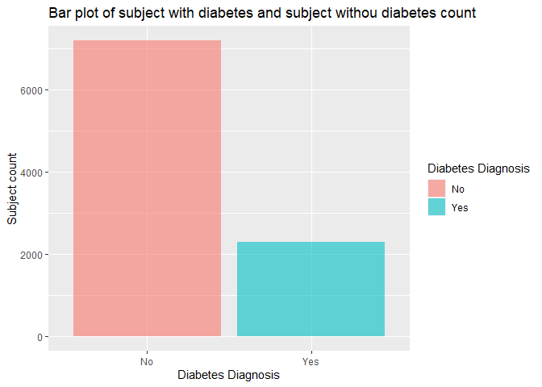
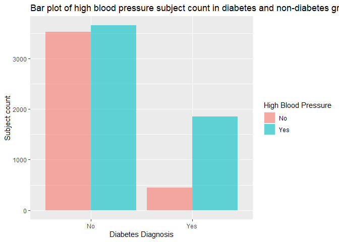
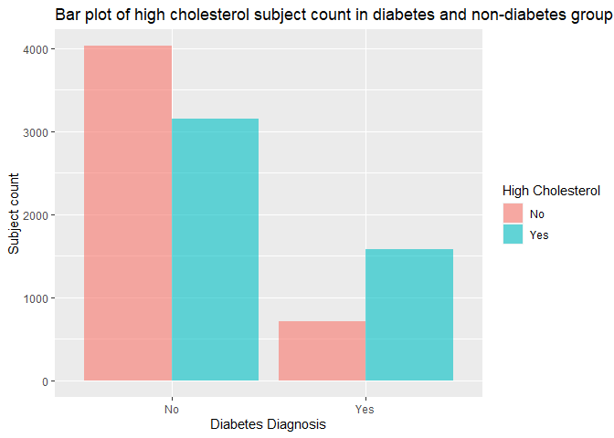
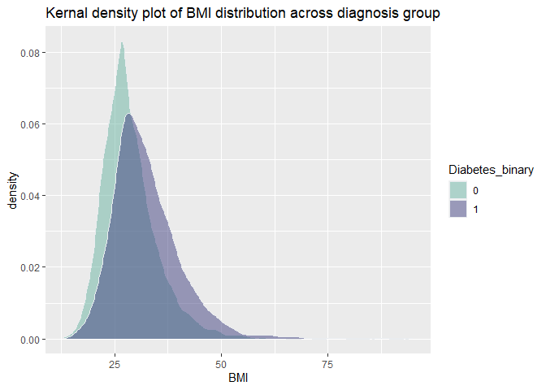
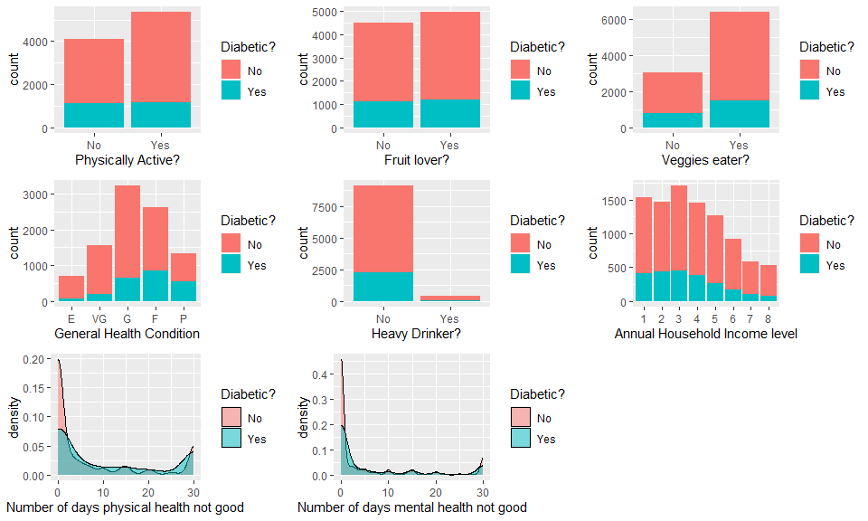
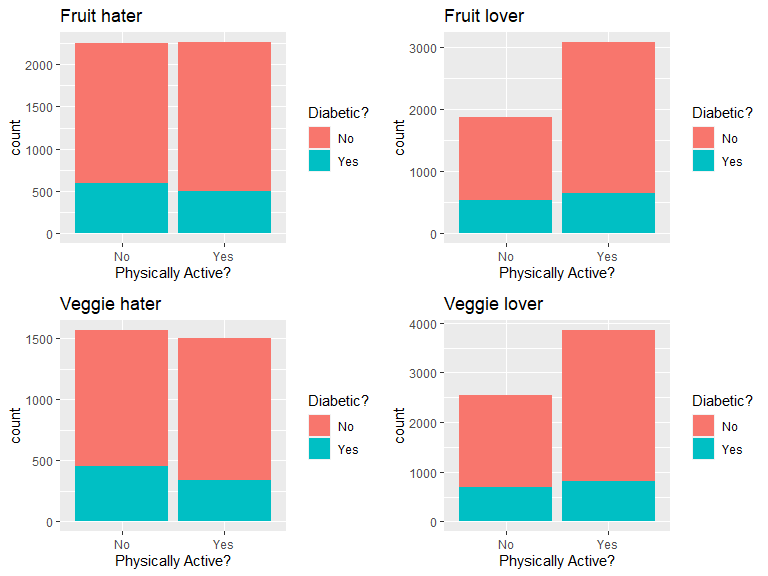
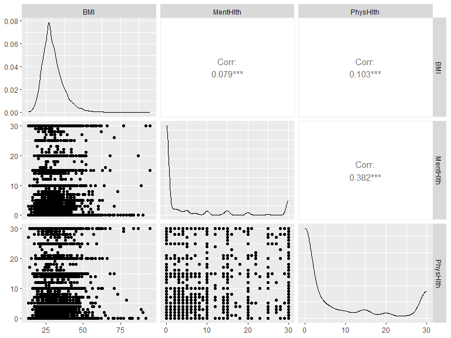

Project 3
================
Vivi Feathers & Siyuan Su
2023-11-02

- [Introduction](#introduction)
- [Data](#data)
- [Summarizations](#summarizations)
  - [The response: “Diabetes_binary”](#the-response-diabetes_binary)
  - [Contigency table and Chi-square](#contigency-table-and-chi-square)
  - [“HighBP”](#highbp)
  - [“HighChol”](#highchol)
  - [“BMI”](#bmi)
  - [Grid of bar and density plots](#grid-of-bar-and-density-plots)
  - [Correlation among numeric
    variables](#correlation-among-numeric-variables)
- [Modeling](#modeling)
  - [Training and test set](#training-and-test-set)
  - [Log-Loss](#log-loss)
  - [Logistic regression](#logistic-regression)
  - [LASSO logistic regression](#lasso-logistic-regression)
  - [Classifcation tree model](#classifcation-tree-model)
  - [Random forest](#random-forest)
  - [Logistic model tree](#logistic-model-tree)
  - [Linear discriminant analysis](#linear-discriminant-analysis)
- [Final model selection](#final-model-selection)

# Introduction

Diabetes are one of the most prevalent chronic disease that are facing
people in the United States as well as in the world. It is estimated
that as large as 11.6% of the US population have diabetes, more than 1/3
of the US population have pre-diabetes. Diabetes is a serious disease in
which individuals lose the ability to effectively regulate levels of
glucose in the blood, and could eventually contribute to complications
like heart disease, vision loss, lower-limb amputation and kidney
diseases. According to the CDC website
(<https://www.cdc.gov/diabetes/>), At age 50, life expectancy is 6 years
shorter for people with type 2 diabetes than for people without it.

Although there are multiple treatment regime for diabetic individual to
effectively control their blood sugar level, there is no cure for the
disease. To make things worse, about 25% of diabetic individuals were
not diagnosed. So there are urgent unmet medical needs to 1. Find
effective preventative measurement to prevent individuals from
developing diabetes and 2. Predict potential pre-diabetic/diabetic
individuals from their life-style related information before they get
diagnosed at a hospital. 3. Find effective measures to help individuals
with diabetic to live a quality life. Making meaningful insight by
exploring data analysis and making prediction using large cohort
comprehensive health data set could help provide solution to the needs
mentioned above.

The data set we’ll be exploring is from The Behavioral Risk Factor
Surveillance System (BRFSS), a health-related telephone survey that is
collected annually by the CDC. The response is a binary variable that
has 2 classes. 0 is for no diabetes, and 1 is for pre-diabetes or
diabetes. There are also 21 variables collected in the data set that
might have some association with the response.

In order to learn the distribution of those variables and their
relationship with each other, we will conduct a series of data
exploratory analysis and generate contingency tables, summary tables,
chi-square tests, bar plots, density plots and correlation chart.

After getting some general understanding about the data, we are planning
on spitting the data set into training and test set, fitting some
prediction models on the training set with different model types and
turning parameters, also utilizing the cross-validation method for model
selection, and log-loss for model performance evaluation. Our final goal
is to find the model that returns the lowest log-loss value when applied
on the test set for prediction.

The model types that we will investigate are:

1.  Logistic regression model.  
2.  LASSO logistic regression model.  
3.  Classification tree model.  
4.  Random forest model.  
5.  Logistic model tree.  
6.  Linear discriminant analysis.

# Data

First of all, We will call the required packages and read in the
“diabetes_binary_health_indicators_BRFSS2015.csv” file. According to the
[data
dictionary](https://www.kaggle.com/datasets/alexteboul/diabetes-health-indicators-dataset/?select=diabetes_binary_health_indicators_BRFSS2015.csv),
there are 22 columns and most of them are categorical variables, we will
convert them to factors and replace the original variables in the code
below using the `as.factor` function. Additionally, since Education
level one has very a few subjects, we will combine Education level 1 and
2 then replace the original Education variable using a series of
`if_else` functions. Lastly, we will utilize a `filter` function and
subset the “diabetes” data set corresponding to the `params$Education`
value in YAML header for R markdown automation purpose.

``` r
library(tidyverse)
library(ggplot2)
library(caret)
library(GGally)
library(devtools)
library(leaps)
library(glmnet)
library(RWeka)
library(gridExtra)
library(readr)
library(scales)
library(MASS)
diabetes <- read_csv(file = "diabetes_binary_health_indicators_BRFSS2015.csv")

# for log-loss purpose, create a new variable and assign value as "YES" for the records have Diabetes_binary = 1 and 'NO' otherwise.
diabetes <- diabetes %>%
            mutate(diabetes_dx = as.factor(if_else(Diabetes_binary == 1, "Yes", "No")))
#use `as.factor` function to replace the original variables.
diabetes$Diabetes_binary <- as.factor(diabetes$Diabetes_binary)
diabetes$HighBP <- as.factor(diabetes$HighBP)
diabetes$HighChol <- as.factor(diabetes$HighChol)
diabetes$CholCheck <- as.factor(diabetes$CholCheck)
diabetes$Smoker <- as.factor(diabetes$Smoker)
diabetes$Stroke <- as.factor(diabetes$Stroke)
diabetes$HeartDiseaseorAttack <- as.factor(diabetes$HeartDiseaseorAttack)
diabetes$PhysActivity <- as.factor(diabetes$PhysActivity)
diabetes$Fruits <- as.factor(diabetes$Fruits)
diabetes$Veggies <- as.factor(diabetes$Veggies)
diabetes$HvyAlcoholConsump <- as.factor(diabetes$HvyAlcoholConsump)
diabetes$AnyHealthcare <- as.factor(diabetes$AnyHealthcare)
diabetes$NoDocbcCost <- as.factor(diabetes$NoDocbcCost)
diabetes$GenHlth <- as.factor(diabetes$GenHlth)
diabetes$DiffWalk <- as.factor(diabetes$DiffWalk)
diabetes$Sex <- as.factor(diabetes$Sex)
diabetes$Age <- as.factor(diabetes$Age)
diabetes$Income <- as.factor(diabetes$Income)

# combine level 1 and 2 of education
diabetes$Education  <- as.factor(if_else(diabetes$Education == 1, 1, 
                                    if_else(diabetes$Education == 2, 1,
                                       if_else(diabetes$Education == 3, 2, 
                                           if_else(diabetes$Education == 4, 3,
                                                    if_else(diabetes$Education == 5, 4,
                                                           if_else(diabetes$Education == 6, 5, NA)))))))

# subset data set based on parameter in YAML header
diabetes_sub <- diabetes %>% 
                   filter(Education == params$Education)
```

# Summarizations

Now we are ready to perform an exploratory data analysis, and give some
Summarizations about the center, spread and distribution of numeric
variables in the form of tables and plots. Also provide contingency
tables and bar plots for categorical variables.

## The response: “Diabetes_binary”

Since “Diabetes_binary” is a binary variable, we will create a one way
contingency table with `table` function to see the count of subjects
with and without diabetes in this education group. Also visualize the
result in a bar chart using `ggplot` + `geom_bar` function. For label
specification on x axis, x ticks, y axis and legend, we will use the
`scale_x_discrete`, the `scale_fill_discrete` and the `labs` functions.

``` r
table(diabetes_sub$Diabetes_binary)
```

    ## 
    ##    0    1 
    ## 7182 2296

``` r
g <- ggplot(data = diabetes_sub, aes(x = Diabetes_binary, fill = Diabetes_binary))
g + geom_bar(alpha = 0.6) +
  scale_x_discrete(breaks=c("0","1"),
        labels=c("No", "Yes")) +
  scale_fill_discrete(name = "Diabetes Diagnosis", labels = c("No", "Yes")) +
  labs(x = "Diabetes Diagnosis", y = "Subject count", title = "Bar plot of subject with diabetes and subject withou diabetes count") 
```

<!-- -->

From this bar chart, we can see which diagnosis group has more subjects
in this education level.

## Contigency table and Chi-square

Now we want to investigate the relationship between having diabetes vs
all the categorical variables. we will create a function which generates
a contingency table, calculates the row percentage for each level of the
corresponding categorical variable in both diagnosis groups, and gives
the chi-square result based on the contingency table.

``` r
chisq <- function (x) {
  #generate contingency table
  a <- table(diabetes_sub$Diabetes_binary, x)
  #calculate the row percentage and combine with original data set
  c <- cbind(a, a/rowSums(a))
  #run chi-square test
  b <- chisq.test(a, correct=FALSE)
  return(list(a, c, b))
}

chisq(diabetes_sub$HighBP)
```

    ## [[1]]
    ##    x
    ##        0    1
    ##   0 3528 3654
    ##   1  447 1849
    ## 
    ## [[2]]
    ##      0    1         0         1
    ## 0 3528 3654 0.4912281 0.5087719
    ## 1  447 1849 0.1946864 0.8053136
    ## 
    ## [[3]]
    ## 
    ##  Pearson's Chi-squared test
    ## 
    ## data:  a
    ## X-squared = 628.3, df = 1, p-value < 2.2e-16

``` r
chisq(diabetes_sub$HighChol)
```

    ## [[1]]
    ##    x
    ##        0    1
    ##   0 4027 3155
    ##   1  714 1582
    ## 
    ## [[2]]
    ##      0    1         0         1
    ## 0 4027 3155 0.5607073 0.4392927
    ## 1  714 1582 0.3109756 0.6890244
    ## 
    ## [[3]]
    ## 
    ##  Pearson's Chi-squared test
    ## 
    ## data:  a
    ## X-squared = 434.02, df = 1, p-value < 2.2e-16

``` r
chisq(diabetes_sub$CholCheck)
```

    ## [[1]]
    ##    x
    ##        0    1
    ##   0  327 6855
    ##   1   17 2279
    ## 
    ## [[2]]
    ##     0    1           0         1
    ## 0 327 6855 0.045530493 0.9544695
    ## 1  17 2279 0.007404181 0.9925958
    ## 
    ## [[3]]
    ## 
    ##  Pearson's Chi-squared test
    ## 
    ## data:  a
    ## X-squared = 72.304, df = 1, p-value < 2.2e-16

``` r
chisq(diabetes_sub$Smoker)
```

    ## [[1]]
    ##    x
    ##        0    1
    ##   0 2724 4458
    ##   1  858 1438
    ## 
    ## [[2]]
    ##      0    1         0         1
    ## 0 2724 4458 0.3792815 0.6207185
    ## 1  858 1438 0.3736934 0.6263066
    ## 
    ## [[3]]
    ## 
    ##  Pearson's Chi-squared test
    ## 
    ## data:  a
    ## X-squared = 0.23109, df = 1, p-value = 0.6307

``` r
chisq(diabetes_sub$Stroke)
```

    ## [[1]]
    ##    x
    ##        0    1
    ##   0 6654  528
    ##   1 1994  302
    ## 
    ## [[2]]
    ##      0   1         0          1
    ## 0 6654 528 0.9264829 0.07351713
    ## 1 1994 302 0.8684669 0.13153310
    ## 
    ## [[3]]
    ## 
    ##  Pearson's Chi-squared test
    ## 
    ## data:  a
    ## X-squared = 73.288, df = 1, p-value < 2.2e-16

``` r
chisq(diabetes_sub$HeartDiseaseorAttack)
```

    ## [[1]]
    ##    x
    ##        0    1
    ##   0 6159 1023
    ##   1 1701  595
    ## 
    ## [[2]]
    ##      0    1         0         1
    ## 0 6159 1023 0.8575606 0.1424394
    ## 1 1701  595 0.7408537 0.2591463
    ## 
    ## [[3]]
    ## 
    ##  Pearson's Chi-squared test
    ## 
    ## data:  a
    ## X-squared = 167.39, df = 1, p-value < 2.2e-16

``` r
chisq(diabetes_sub$PhysActivity)
```

    ## [[1]]
    ##    x
    ##        0    1
    ##   0 2981 4201
    ##   1 1138 1158
    ## 
    ## [[2]]
    ##      0    1         0         1
    ## 0 2981 4201 0.4150654 0.5849346
    ## 1 1138 1158 0.4956446 0.5043554
    ## 
    ## [[3]]
    ## 
    ##  Pearson's Chi-squared test
    ## 
    ## data:  a
    ## X-squared = 45.973, df = 1, p-value = 1.199e-11

``` r
chisq(diabetes_sub$Fruits)
```

    ## [[1]]
    ##    x
    ##        0    1
    ##   0 3420 3762
    ##   1 1095 1201
    ## 
    ## [[2]]
    ##      0    1         0         1
    ## 0 3420 3762 0.4761905 0.5238095
    ## 1 1095 1201 0.4769164 0.5230836
    ## 
    ## [[3]]
    ## 
    ##  Pearson's Chi-squared test
    ## 
    ## data:  a
    ## X-squared = 0.0036752, df = 1, p-value = 0.9517

``` r
chisq(diabetes_sub$Veggies)
```

    ## [[1]]
    ##    x
    ##        0    1
    ##   0 2275 4907
    ##   1  793 1503
    ## 
    ## [[2]]
    ##      0    1         0         1
    ## 0 2275 4907 0.3167641 0.6832359
    ## 1  793 1503 0.3453833 0.6546167
    ## 
    ## [[3]]
    ## 
    ##  Pearson's Chi-squared test
    ## 
    ## data:  a
    ## X-squared = 6.5093, df = 1, p-value = 0.01073

``` r
chisq(diabetes_sub$HvyAlcoholConsump)
```

    ## [[1]]
    ##    x
    ##        0    1
    ##   0 6852  330
    ##   1 2256   40
    ## 
    ## [[2]]
    ##      0   1         0         1
    ## 0 6852 330 0.9540518 0.0459482
    ## 1 2256  40 0.9825784 0.0174216
    ## 
    ## [[3]]
    ## 
    ##  Pearson's Chi-squared test
    ## 
    ## data:  a
    ## X-squared = 37.741, df = 1, p-value = 8.08e-10

``` r
chisq(diabetes_sub$AnyHealthcare)
```

    ## [[1]]
    ##    x
    ##        0    1
    ##   0  990 6192
    ##   1  144 2152
    ## 
    ## [[2]]
    ##     0    1          0         1
    ## 0 990 6192 0.13784461 0.8621554
    ## 1 144 2152 0.06271777 0.9372822
    ## 
    ## [[3]]
    ## 
    ##  Pearson's Chi-squared test
    ## 
    ## data:  a
    ## X-squared = 93.226, df = 1, p-value < 2.2e-16

``` r
chisq(diabetes_sub$NoDocbcCost)
```

    ## [[1]]
    ##    x
    ##        0    1
    ##   0 6010 1172
    ##   1 1925  371
    ## 
    ## [[2]]
    ##      0    1         0         1
    ## 0 6010 1172 0.8368143 0.1631857
    ## 1 1925  371 0.8384146 0.1615854
    ## 
    ## [[3]]
    ## 
    ##  Pearson's Chi-squared test
    ## 
    ## data:  a
    ## X-squared = 0.032694, df = 1, p-value = 0.8565

``` r
chisq(diabetes_sub$GenHlth)
```

    ## [[1]]
    ##    x
    ##        1    2    3    4    5
    ##   0  644 1379 2577 1786  796
    ##   1   66  194  656  840  540
    ## 
    ## [[2]]
    ##     1    2    3    4   5          1          2         3         4         5
    ## 0 644 1379 2577 1786 796 0.08966862 0.19200780 0.3588137 0.2486772 0.1108326
    ## 1  66  194  656  840 540 0.02874564 0.08449477 0.2857143 0.3658537 0.2351916
    ## 
    ## [[3]]
    ## 
    ##  Pearson's Chi-squared test
    ## 
    ## data:  a
    ## X-squared = 511.73, df = 4, p-value < 2.2e-16

``` r
chisq(diabetes_sub$DiffWalk)
```

    ## [[1]]
    ##    x
    ##        0    1
    ##   0 4918 2264
    ##   1 1051 1245
    ## 
    ## [[2]]
    ##      0    1         0         1
    ## 0 4918 2264 0.6847675 0.3152325
    ## 1 1051 1245 0.4577526 0.5422474
    ## 
    ## [[3]]
    ## 
    ##  Pearson's Chi-squared test
    ## 
    ## data:  a
    ## X-squared = 384.55, df = 1, p-value < 2.2e-16

``` r
chisq(diabetes_sub$Sex)
```

    ## [[1]]
    ##    x
    ##        0    1
    ##   0 4135 3047
    ##   1 1377  919
    ## 
    ## [[2]]
    ##      0    1         0         1
    ## 0 4135 3047 0.5757449 0.4242551
    ## 1 1377  919 0.5997387 0.4002613
    ## 
    ## [[3]]
    ## 
    ##  Pearson's Chi-squared test
    ## 
    ## data:  a
    ## X-squared = 4.1159, df = 1, p-value = 0.04248

``` r
chisq(diabetes_sub$Income)
```

    ## [[1]]
    ##    x
    ##        1    2    3    4    5    6    7    8
    ##   0 1119 1026 1261 1075 1001  756  485  459
    ##   1  417  439  448  378  267  165  105   77
    ## 
    ## [[2]]
    ##      1    2    3    4    5   6   7   8         1         2         3         4         5          6          7          8
    ## 0 1119 1026 1261 1075 1001 756 485 459 0.1558062 0.1428571 0.1755778 0.1496798 0.1393762 0.10526316 0.06752994 0.06390977
    ## 1  417  439  448  378  267 165 105  77 0.1816202 0.1912021 0.1951220 0.1646341 0.1162892 0.07186411 0.04573171 0.03353659
    ## 
    ## [[3]]
    ## 
    ##  Pearson's Chi-squared test
    ## 
    ## data:  a
    ## X-squared = 108.25, df = 7, p-value < 2.2e-16

We need to pay attention to the categorical variable with a significant
chi-square result (p value smaller than 0.05), that means this
categorical variable may have certain relationship with the diabetes
diagnosis.

## “HighBP”

As we all know, high blood pressure and diabetes are related, we want to
create a bar chart and visualize the high blood pressure subjects’ count
and ratio in each diagnosis group. Here we will again, use the `gglot`
function and the `geom_bar` function to create the plot. Like last bar
chart, we also will set labels for x axis, x ticks, y axis and legend
with the `scale_x_discrete`, the `scale_fill_discrete` and the`labs`
functions.

``` r
# create a bar plot using the gglot and the geom_bar function.
h <- ggplot(data = diabetes_sub, aes(x = Diabetes_binary, fill = HighBP))
h + geom_bar(position = "dodge", alpha = 0.6) +
  scale_x_discrete(breaks=c("0","1"),
       labels=c("No", "Yes")) +
  scale_fill_discrete(name = "High Blood Pressure", labels = c("No", "Yes")) +
  labs(x = "Diabetes Diagnosis", y = "Subject count", title = "Bar plot of high blood pressure subject count in diabetes and non-diabetes group")
```

<!-- -->

In the bar chart above, we need to focus on the count and ratio of
subjects with high blood pressure vs subjects without in both diabetes
and non-diabetes group, and verify if the ratio of high blood pressure
subjects in the diabetes group is higher than the non-diabetes group’s
as we assumed.

## “HighChol”

Another health condition that associates with diabetes is high
cholesterol, we also want to create a bar chart and compare the high
cholesterol subjects’ count and ratio in each diagnosis group, using all
the functions we used for previous bar plots.

``` r
# create a bar plot using the gglot and the geom_bar function.
h <- ggplot(data = diabetes_sub, aes(x = Diabetes_binary, fill = HighChol))
h + geom_bar(position = "dodge", alpha = 0.6) +
  scale_x_discrete(breaks=c("0","1"),
       labels=c("No", "Yes")) +
  scale_fill_discrete(name = "High Cholesterol", labels = c("No", "Yes")) +
  labs(x = "Diabetes Diagnosis", y = "Subject count", title = "Bar plot of high cholesterol subject count in diabetes and non-diabetes group")
```

<!-- -->

In the bar chart above, we also need to look at the count and ratio of
subjects with high cholesterol vs subjects without in both diabetes and
non-diabetes group, and verify if the ratio of high cholesterol subjects
in the diabetes group is higher than the non-diabetes group’s as we
expected.

## “BMI”

The association of high BMI and diabetes are proved in many scientific
studies, in order to verify if this association also exists in our data,
we are looking into the distribution of BMI in both diagnosis group by
creating a summary table using `group_by` and `summarise` function, as
well as generating a kernel density plot with `ggplot` and
`geom_density` function. Additionally, we want to conduct a two sample
t-test with `t.test` function and investigate if the means in each
diagnosis group are different from each other.

``` r
#create a summary table for BMI to display the center and spread
diabetes_sub %>%
  group_by(Diabetes_binary) %>%
  summarise(Mean = mean(BMI),  Standard_Deviation = sd(BMI), 
            Variance = var(BMI), Median = median(BMI), 
            q1 = quantile(BMI, probs = 0.25),
            q3 = quantile(BMI, probs = 0.75))
```

    ## # A tibble: 2 × 7
    ##   Diabetes_binary  Mean Standard_Deviation Variance Median    q1    q3
    ##   <fct>           <dbl>              <dbl>    <dbl>  <dbl> <dbl> <dbl>
    ## 1 0                28.8               6.95     48.3     27    24    32
    ## 2 1                32.4               7.87     61.9     31    27    37

``` r
#generate a kernal density plot to show the distribution of BMI
i <- ggplot(data = diabetes_sub, aes(x = BMI, fill = Diabetes_binary)) 
i + geom_density(adjust = 1, color="#e9ecef", alpha=0.5, position = 'dodge') +
  scale_fill_manual(values=c("#69b3a2", "#404080")) +
  labs(x = "BMI", title = "Kernal density plot of BMI distribution across diagnosis group") 
```

<!-- -->

``` r
#conduct a two sample t test for BMI in both diagnosis groups
t.test(BMI ~ Diabetes_binary, data = diabetes_sub, alternative = "two.sided", var.equal = FALSE)
```

    ## 
    ##  Welch Two Sample t-test
    ## 
    ## data:  BMI by Diabetes_binary
    ## t = -20.041, df = 3513.9, p-value < 2.2e-16
    ## alternative hypothesis: true difference in means between group 0 and group 1 is not equal to 0
    ## 95 percent confidence interval:
    ##  -4.038248 -3.318513
    ## sample estimates:
    ## mean in group 0 mean in group 1 
    ##        28.75063        32.42901

The summary table gives us the center (mean and median) and spread
(standard_deviation, variance, q1 and q3) of BMI in each diagnosis
group. The density plot shows the distribution of BMI in each diagnosis
group, we can estimate the means and standard deviations, also visualize
their differences. Lastly, the two sample t-test returns the 95%
confidence interval of mean difference, and the t statistic, degree of
freedom and p-value as t-test result, we need to see if the p-value is
smaller than 0.05 to decide whether we will reject the null hypothesis
(true difference in means between two diagnosis is equal to 0).

## Grid of bar and density plots

Beside above 3 variables that we investigated individually, we still
want to have a brief concept about the distribution of other variables
that were not mentioned that often in scientific articles about their
association with diabetes diagnosis. Compared with contingency tables,
bar/density plots are often visually more appealing and easier to
understand.

In order to create bar plot for visualizing the distribution of diabetic
people in each category of variables, we need to use the `ggplot`
package, and the `geom_bar` function will be applied. For numeric
variable, the `geom_density` function will be used for displaying their
distributions. As previous, Function `labs` were used to input the label
for each plot, and `scale_x_discrete` function was used to create label
for each category on the x-axis, meanwhile `scale_fill_discrete`
function was used to provide label in the legend.

``` r
PHlthplot<-ggplot(diabetes_sub,aes(x=PhysHlth,fill=Diabetes_binary))+
  geom_density(adjust=1,alpha=0.5)+
  scale_fill_discrete(name="Diabetic?", label=c("No","Yes"))+
  labs(x="Number of days physical health not good")
MHlthplot<-ggplot(diabetes_sub,aes(x=MentHlth,fill=Diabetes_binary))+
  geom_density(adjust=1,alpha=0.5)+
  scale_fill_discrete(name="Diabetic?", label=c("No","Yes"))+
  labs(x="Number of days mental health not good")
Physplot<-ggplot(diabetes_sub,aes(x=PhysActivity))+
  geom_bar(aes(fill=(Diabetes_binary)))+
  labs(x="Physically Active?")+
  scale_x_discrete(labels=c("No","Yes"))+
  scale_fill_discrete(name="Diabetic?", label=c("No","Yes"))
Fruitplot<-ggplot(diabetes_sub,aes(x=Fruits))+
  geom_bar(aes(fill=(Diabetes_binary)))+
  labs(x="Fruit lover?")+
  scale_x_discrete(labels=c("No","Yes"))+
  scale_fill_discrete(name="Diabetic?", label=c("No","Yes"))
Veggieplot<-ggplot(diabetes_sub,aes(x=Veggies))+
  geom_bar(aes(fill=(Diabetes_binary)))+
  labs(x="Veggies eater?")+
  scale_x_discrete(labels=c("No","Yes"))+
  scale_fill_discrete(name="Diabetic?", label=c("No","Yes"))
GHlthplot<-ggplot(diabetes_sub,aes(x=GenHlth))+
  geom_bar(aes(fill=(Diabetes_binary)))+
  labs(x="General Health Condition")+
  scale_x_discrete(labels=c("E","VG", "G", "F", "P"))+
  scale_fill_discrete(name="Diabetic?", label=c("No","Yes"))
Incomeplot<-ggplot(diabetes_sub,aes(x=Income))+
  geom_bar(aes(fill=(Diabetes_binary)))+
  labs(x="Annual Household Income level")+
  scale_x_discrete(labels=c("1","2", "3","4", "5","6","7", "8"))+
  scale_fill_discrete(name="Diabetic?", label=c("No","Yes"))
Alcoholplot<-ggplot(diabetes_sub,aes(x=HvyAlcoholConsump))+
  geom_bar(aes(fill=(Diabetes_binary)))+
  labs(x="Heavy Drinker?")+
  scale_x_discrete(labels=c("No","Yes"))+
  scale_fill_discrete(name="Diabetic?", label=c("No","Yes"))
```

It would be very cumbersome to view each graph independently, so we are
putting them in a tile with the `grid.arrange` function.

``` r
grid.arrange(Physplot,Fruitplot,Veggieplot,GHlthplot,Alcoholplot,Incomeplot,PHlthplot,MHlthplot,ncol=3)
```

<!-- -->

The contrasting color red (no diabetes) and blue (have diabetes)
provides a straightforward way to visualize the how the ratio of people
who have diabetes are affected by the value of variables. Note that
different variables may have interactions, if interested we could
further split the value of a variable by another variable, just like
what will be shown in the next graph.

``` r
diabetes_Edu1_nofruit<-diabetes_sub%>%filter(Fruits=="0")
diabetes_Edu1_yesfruit<-diabetes_sub%>%filter(Fruits=="1")
diabetes_Edu1_noveggie<-diabetes_sub%>%filter(Veggies=="0")
diabetes_Edu1_yesveggie<-diabetes_sub%>%filter(Veggies=="1")
Physnofruitplot<-ggplot(diabetes_Edu1_nofruit,aes(x=PhysActivity))+
  geom_bar(aes(fill=(Diabetes_binary)))+
  ggtitle("Fruit hater")+
  labs(x="Physically Active?")+
  scale_x_discrete(labels=c("No","Yes"))+
  scale_fill_discrete(name="Diabetic?", label=c("No","Yes"))
Physyesfruitplot<-ggplot(diabetes_Edu1_yesfruit,aes(x=PhysActivity))+
  geom_bar(aes(fill=(Diabetes_binary)))+
  ggtitle("Fruit lover")+
  labs(x="Physically Active?")+
  scale_x_discrete(labels=c("No","Yes"))+
  scale_fill_discrete(name="Diabetic?", label=c("No","Yes"))
Physnoveggieplot<-ggplot(diabetes_Edu1_noveggie,aes(x=PhysActivity))+
  geom_bar(aes(fill=(Diabetes_binary)))+
  ggtitle("Veggie hater")+
  labs(x="Physically Active?")+
  scale_x_discrete(labels=c("No","Yes"))+
  scale_fill_discrete(name="Diabetic?", label=c("No","Yes"))
Physyesveggieplot<-ggplot(diabetes_Edu1_yesveggie,aes(x=PhysActivity))+
  geom_bar(aes(fill=(Diabetes_binary)))+
  ggtitle("Veggie lover")+
  labs(x="Physically Active?")+
  scale_x_discrete(labels=c("No","Yes"))+
  scale_fill_discrete(name="Diabetic?", label=c("No","Yes"))
```

``` r
grid.arrange(Physnofruitplot,Physyesfruitplot,Physnoveggieplot,Physyesveggieplot)
```

<!-- -->

This plot panel showed the effect of physical activity on diabetes
status in people who eat/do not eat fruits or veggies. Compared with
diabetes patients, is there higher ratio of physically active people in
the non-diabetes group that are also fruit & vegetable lovers?

## Correlation among numeric variables

Before fitting any model, we also want to test the correlation among
numeric variables, in case there is collinearity that diminishes our
ability to determine which variables are responsible for change in the
response variable. For this reason, we should determine correlations
between all variables and consider removing ones that are problematic.
We can do this by creating a correlation plot with `ggpairs()` from the
`GGally` package.

``` r
x <- diabetes_sub[, c(5, 16, 17)] 
GGally::ggpairs(x)
```

<!-- -->

Let’s look for the pairs that have correlation coefficient higher than
0.4. If we do find such pairs, we need to refer to the correlations
between each variable and the response & other predictors, as well as
some background knowledge (may do a literature review), in order to
decide which variable will be include into the models.

# Modeling

Since we gained some basic understanding of the data, we can now fit
different models and select the best one for prediction.

## Training and test set

The first step is to split our data to a training and test set. We will
use the `createDataPartition` function and split the data by 70% as the
training set and 30% as the test set.

``` r
set.seed(20)
index <- createDataPartition(diabetes_sub$Diabetes_binary, p = 0.70, list = FALSE)
train <- diabetes_sub[index, ]
test <- diabetes_sub[-index, ]
```

## Log-Loss

All of our models’ performance will be evaluated by Log-loss. Log loss,
also known as logarithmic loss, indicates how close a prediction
probability comes to the corresponding true binary value. Thus, it is a
common evaluation metric for binary classification models. There are
three steps to calculate Log Loss:

1.  Finding the corrected probabilities.  
2.  Taking a log of corrected probabilities.  
3.  Taking the negative average of the values from step 2.

And the formula is as below:


From the formula we can tell, the lower log-loss is, the better the
model performs.

The reason that log-loss is preferred to accuracy is: For accuracy,
model returns 1 if predicted probability is \> .5 otherwise 0. We could
get some prediction probabilities very close to 0.5, but are converted
to 1 and 0 which actually match with the true results. Such model could
have 100% accuracy but their prediction probabilities are at board line
of being wrong. If we use accuracy for model selection, we will keep a
bad model. On the other hand, log-loss calculate how far away the
prediction probabilities are from the true values, and the log-loss of
such model will be high, which reveal the model’s true performance.
Thus, log-loss is more reliable and accurate for model selection.

## Logistic regression

The first model we are fitting is logistic regression, which is a
generalized linear model that models the probability of an event by
calculating the log-odds for the event based on the linear combination
of one or more independent variables. The most common logistic
regression has a single binary variable as the response, usually the two
values are coded as “0” and “1”.

In logistic regression, the dependent variable is a logit, which is the
natural log of the odds and assumed to be linearly related to X as the
formula below:


In our data set, logistic regression models are more suitable for our
binary response than linear regression models because:

1.  If we use linear regression, the predicted values will become
    greater than one and less than zero if we move far enough on the
    X-axis. Such values are not realistic for binary variable.  
2.  One of the assumptions of regression is that the variance of Y is
    constant across values of X (homoscedasticity). This can not be the
    case with a binary variable.  
3.  The significance testing of the b weights rest upon the assumption
    that errors of prediction (Y-Y’) are normally distributed. Because Y
    only takes the values 0 and 1, this assumption is pretty hard to
    justify.

Now, let’s fit 3 logistic regression models with the `train` function on
the training data set, and use cross-validation with 5 folds for model
selection. After the best model is picked, use the `predict` function to
apply it on the test data set and merge the predicted results with the
test set’s true response. We will use the `mnLogLoss` function to
evaluate their performance with a log-loss method.

After log-loss values get calculated for all three models, we will
create a data frame with all the log-loss values and their corresponding
model names, then return the row with the lowest log-loss value by using
the `which.min` function. Lastly, we will insert the model name as an
inline R code into the conclusion.

### Model one

We will include all the low level variables in our first model:

``` r
#fit the model on the training data set
full_log <- train(diabetes_dx ~ HighBP + HighChol + CholCheck + BMI + Smoker + Stroke + HeartDiseaseorAttack 
                  + PhysActivity + Fruits + Veggies + HvyAlcoholConsump + AnyHealthcare + NoDocbcCost + GenHlth + MentHlth 
                  + PhysHlth + DiffWalk + Sex + Age + Income,
              data=train, 
              method = "glm", 
              family = "binomial",
              metric="logLoss",
              preProcess = c("center", "scale"),
              trControl = trainControl(method = "cv", number = 5, classProbs=TRUE, summaryFunction=mnLogLoss))
full_log
```

    ## Generalized Linear Model 
    ## 
    ## 6636 samples
    ##   20 predictor
    ##    2 classes: 'No', 'Yes' 
    ## 
    ## Pre-processing: centered (40), scaled (40) 
    ## Resampling: Cross-Validated (5 fold) 
    ## Summary of sample sizes: 5308, 5308, 5309, 5310, 5309 
    ## Resampling results:
    ## 
    ##   logLoss  
    ##   0.4745838

``` r
summary(full_log)
```

    ## 
    ## Call:
    ## NULL
    ## 
    ## Coefficients:
    ##                        Estimate Std. Error z value Pr(>|z|)    
    ## (Intercept)           -1.468238   0.039629 -37.049  < 2e-16 ***
    ## HighBP1                0.306761   0.037503   8.180 2.84e-16 ***
    ## HighChol1              0.270733   0.033839   8.001 1.24e-15 ***
    ## CholCheck1             0.202825   0.058146   3.488 0.000486 ***
    ## BMI                    0.421503   0.032821  12.843  < 2e-16 ***
    ## Smoker1               -0.046709   0.033418  -1.398 0.162200    
    ## Stroke1                0.033997   0.029001   1.172 0.241085    
    ## HeartDiseaseorAttack1  0.009496   0.030654   0.310 0.756720    
    ## PhysActivity1         -0.030725   0.032491  -0.946 0.344323    
    ## Fruits1                0.049214   0.033138   1.485 0.137514    
    ## Veggies1              -0.016986   0.032360  -0.525 0.599661    
    ## HvyAlcoholConsump1    -0.140893   0.041478  -3.397 0.000682 ***
    ## AnyHealthcare1         0.114340   0.040350   2.834 0.004601 ** 
    ## NoDocbcCost1           0.024121   0.033821   0.713 0.475730    
    ## GenHlth2               0.012972   0.072117   0.180 0.857251    
    ## GenHlth3               0.285918   0.084098   3.400 0.000674 ***
    ## GenHlth4               0.421006   0.080525   5.228 1.71e-07 ***
    ## GenHlth5               0.433019   0.069024   6.273 3.53e-10 ***
    ## MentHlth              -0.011141   0.034330  -0.325 0.745530    
    ## PhysHlth              -0.056970   0.039565  -1.440 0.149890    
    ## DiffWalk1              0.072632   0.036094   2.012 0.044190 *  
    ## Sex1                   0.091037   0.033779   2.695 0.007037 ** 
    ## Age2                   0.140474   0.118057   1.190 0.234092    
    ## Age3                   0.201899   0.149184   1.353 0.175941    
    ## Age4                   0.225744   0.151510   1.490 0.136234    
    ## Age5                   0.319868   0.164800   1.941 0.052265 .  
    ## Age6                   0.424444   0.179377   2.366 0.017972 *  
    ## Age7                   0.555082   0.216363   2.566 0.010302 *  
    ## Age8                   0.638061   0.231722   2.754 0.005895 ** 
    ## Age9                   0.680703   0.227617   2.991 0.002785 ** 
    ## Age10                  0.660269   0.223174   2.959 0.003091 ** 
    ## Age11                  0.725645   0.230843   3.143 0.001670 ** 
    ## Age12                  0.624137   0.213222   2.927 0.003421 ** 
    ## Age13                  0.629135   0.227514   2.765 0.005688 ** 
    ## Income2                0.015236   0.038696   0.394 0.693771    
    ## Income3               -0.001140   0.040662  -0.028 0.977627    
    ## Income4               -0.001879   0.039989  -0.047 0.962522    
    ## Income5               -0.054128   0.040432  -1.339 0.180657    
    ## Income6               -0.100433   0.041253  -2.435 0.014910 *  
    ## Income7               -0.088579   0.040320  -2.197 0.028030 *  
    ## Income8               -0.023825   0.041213  -0.578 0.563209    
    ## ---
    ## Signif. codes:  0 '***' 0.001 '**' 0.01 '*' 0.05 '.' 0.1 ' ' 1
    ## 
    ## (Dispersion parameter for binomial family taken to be 1)
    ## 
    ##     Null deviance: 7349.1  on 6635  degrees of freedom
    ## Residual deviance: 6212.9  on 6595  degrees of freedom
    ## AIC: 6294.9
    ## 
    ## Number of Fisher Scoring iterations: 6

``` r
#apply the best model on the test set and merge the predicted results with the true response into one data frame
predicted <- data.frame(obs=test$diabetes_dx,
             pred=predict(full_log, test),
             predict(full_log, test, type="prob"))

#calculate the log-loss
a <- mnLogLoss(predicted, lev = levels(predicted$obs))
```

### Model two

We will include all the low level variables and interactions between
HighBP & HighChol, HighBP & BMI, HighChol & BMI, PhysActivity & BMI, and
BMI & GenHlth in our second model:

``` r
#fit the model on the training data set
inter_log <- train(diabetes_dx ~ HighBP + HighChol + CholCheck + BMI + Smoker + Stroke + HeartDiseaseorAttack 
                  + PhysActivity + Fruits + Veggies + HvyAlcoholConsump + AnyHealthcare + NoDocbcCost + GenHlth + MentHlth 
                  + PhysHlth + DiffWalk + Sex + Age + Income + HighBP:HighChol + HighBP:BMI + HighChol:BMI + PhysActivity:BMI + BMI:GenHlth,
              data=train, 
              method = "glm", 
              family = "binomial",
              metric="logLoss",
              preProcess = c("center", "scale"),
              trControl = trainControl(method = "cv", number = 5, classProbs=TRUE, summaryFunction=mnLogLoss))
inter_log
```

    ## Generalized Linear Model 
    ## 
    ## 6636 samples
    ##   20 predictor
    ##    2 classes: 'No', 'Yes' 
    ## 
    ## Pre-processing: centered (48), scaled (48) 
    ## Resampling: Cross-Validated (5 fold) 
    ## Summary of sample sizes: 5309, 5308, 5310, 5309, 5308 
    ## Resampling results:
    ## 
    ##   logLoss  
    ##   0.4771535

``` r
summary(inter_log)
```

    ## 
    ## Call:
    ## NULL
    ## 
    ## Coefficients:
    ##                         Estimate Std. Error z value Pr(>|z|)    
    ## (Intercept)           -1.4605421  0.0400092 -36.505  < 2e-16 ***
    ## HighBP1                0.2696563  0.1515275   1.780 0.075144 .  
    ## HighChol1              0.0544353  0.1437452   0.379 0.704916    
    ## CholCheck1             0.2038522  0.0584077   3.490 0.000483 ***
    ## BMI                    0.2606713  0.1685131   1.547 0.121890    
    ## Smoker1               -0.0454635  0.0335062  -1.357 0.174823    
    ## Stroke1                0.0347482  0.0291019   1.194 0.232472    
    ## HeartDiseaseorAttack1  0.0096240  0.0307929   0.313 0.754631    
    ## PhysActivity1          0.0335031  0.1352559   0.248 0.804366    
    ## Fruits1                0.0480645  0.0332248   1.447 0.147996    
    ## Veggies1              -0.0182471  0.0324247  -0.563 0.573603    
    ## HvyAlcoholConsump1    -0.1424303  0.0415587  -3.427 0.000610 ***
    ## AnyHealthcare1         0.1132386  0.0404358   2.800 0.005103 ** 
    ## NoDocbcCost1           0.0250407  0.0339202   0.738 0.460380    
    ## GenHlth2              -0.2917317  0.2931986  -0.995 0.319738    
    ## GenHlth3               0.1749318  0.3342515   0.523 0.600728    
    ## GenHlth4               0.2698743  0.3121375   0.865 0.387258    
    ## GenHlth5               0.1662351  0.2556400   0.650 0.515518    
    ## MentHlth              -0.0132099  0.0345271  -0.383 0.702019    
    ## PhysHlth              -0.0574456  0.0397208  -1.446 0.148111    
    ## DiffWalk1              0.0730632  0.0361845   2.019 0.043468 *  
    ## Sex1                   0.0909422  0.0338198   2.689 0.007166 ** 
    ## Age2                   0.1454203  0.1181329   1.231 0.218327    
    ## Age3                   0.2132892  0.1492591   1.429 0.153008    
    ## Age4                   0.2361470  0.1515842   1.558 0.119266    
    ## Age5                   0.3274282  0.1649059   1.986 0.047084 *  
    ## Age6                   0.4323235  0.1794519   2.409 0.015990 *  
    ## Age7                   0.5643892  0.2164548   2.607 0.009123 ** 
    ## Age8                   0.6480354  0.2318310   2.795 0.005185 ** 
    ## Age9                   0.6931213  0.2277238   3.044 0.002337 ** 
    ## Age10                  0.6726590  0.2232808   3.013 0.002590 ** 
    ## Age11                  0.7365247  0.2309638   3.189 0.001428 ** 
    ## Age12                  0.6322193  0.2133269   2.964 0.003040 ** 
    ## Age13                  0.6404641  0.2276185   2.814 0.004897 ** 
    ## Income2                0.0176520  0.0388379   0.455 0.649466    
    ## Income3                0.0021152  0.0407909   0.052 0.958644    
    ## Income4                0.0007972  0.0400945   0.020 0.984137    
    ## Income5               -0.0508190  0.0405525  -1.253 0.210145    
    ## Income6               -0.0985637  0.0413505  -2.384 0.017143 *  
    ## Income7               -0.0872602  0.0404166  -2.159 0.030849 *  
    ## Income8               -0.0240413  0.0412473  -0.583 0.559989    
    ## `HighBP1:HighChol1`    0.0085090  0.0710875   0.120 0.904723    
    ## `HighBP1:BMI`          0.0372711  0.1546467   0.241 0.809549    
    ## `HighChol1:BMI`        0.2184276  0.1392959   1.568 0.116862    
    ## `BMI:PhysActivity1`   -0.0641942  0.1313398  -0.489 0.625009    
    ## `BMI:GenHlth2`         0.2973764  0.2779309   1.070 0.284635    
    ## `BMI:GenHlth3`         0.1192455  0.3362873   0.355 0.722894    
    ## `BMI:GenHlth4`         0.1669441  0.3264917   0.511 0.609122    
    ## `BMI:GenHlth5`         0.2824728  0.2622960   1.077 0.281514    
    ## ---
    ## Signif. codes:  0 '***' 0.001 '**' 0.01 '*' 0.05 '.' 0.1 ' ' 1
    ## 
    ## (Dispersion parameter for binomial family taken to be 1)
    ## 
    ##     Null deviance: 7349.1  on 6635  degrees of freedom
    ## Residual deviance: 6206.1  on 6587  degrees of freedom
    ## AIC: 6304.1
    ## 
    ## Number of Fisher Scoring iterations: 6

``` r
#apply the best model on the test set and merge the predicted results with the true response into one data frame
predicted2 <- data.frame(obs=test$diabetes_dx,
             pred=predict(inter_log, test),
             predict(inter_log, test, type="prob"))

#calculate the log-loss
b <- mnLogLoss(predicted2, lev = levels(predicted2$obs))
```

### Model three

We will include all the low level variables and polynomial term for
numeric variables in our third model:

``` r
#fit the model on the training data set
poly_log <- train(diabetes_dx ~  HighBP + HighChol + CholCheck + I(BMI^2) + BMI + Smoker 
                  + Stroke + HeartDiseaseorAttack + PhysActivity + Fruits + Veggies + HvyAlcoholConsump + AnyHealthcare + NoDocbcCost + GenHlth 
                  + I(MentHlth^2) + MentHlth + I(PhysHlth^2) + PhysHlth + DiffWalk + Sex + Age + Income,
              data=train, 
              method = "glm", 
              family = "binomial",
              metric="logLoss",
              preProcess = c("center", "scale"),
              trControl = trainControl(method = "cv", number = 5, classProbs=TRUE, summaryFunction=mnLogLoss))
poly_log
```

    ## Generalized Linear Model 
    ## 
    ## 6636 samples
    ##   20 predictor
    ##    2 classes: 'No', 'Yes' 
    ## 
    ## Pre-processing: centered (43), scaled (43) 
    ## Resampling: Cross-Validated (5 fold) 
    ## Summary of sample sizes: 5309, 5309, 5308, 5309, 5309 
    ## Resampling results:
    ## 
    ##   logLoss  
    ##   0.4715317

``` r
summary(poly_log)
```

    ## 
    ## Call:
    ## NULL
    ## 
    ## Coefficients:
    ##                        Estimate Std. Error z value Pr(>|z|)    
    ## (Intercept)           -1.488992   0.040076 -37.154  < 2e-16 ***
    ## HighBP1                0.288990   0.037658   7.674 1.67e-14 ***
    ## HighChol1              0.260338   0.033981   7.661 1.84e-14 ***
    ## CholCheck1             0.200377   0.058314   3.436  0.00059 ***
    ## `I(BMI^2)`            -0.829706   0.131907  -6.290 3.17e-10 ***
    ## BMI                    1.264369   0.136642   9.253  < 2e-16 ***
    ## Smoker1               -0.038360   0.033558  -1.143  0.25300    
    ## Stroke1                0.036513   0.029255   1.248  0.21199    
    ## HeartDiseaseorAttack1  0.008628   0.030879   0.279  0.77992    
    ## PhysActivity1         -0.030124   0.032634  -0.923  0.35597    
    ## Fruits1                0.052442   0.033293   1.575  0.11522    
    ## Veggies1              -0.015978   0.032513  -0.491  0.62312    
    ## HvyAlcoholConsump1    -0.134784   0.041537  -3.245  0.00117 ** 
    ## AnyHealthcare1         0.112026   0.040359   2.776  0.00551 ** 
    ## NoDocbcCost1           0.017286   0.034053   0.508  0.61172    
    ## GenHlth2               0.006374   0.072012   0.089  0.92947    
    ## GenHlth3               0.273304   0.083988   3.254  0.00114 ** 
    ## GenHlth4               0.412262   0.080747   5.106 3.30e-07 ***
    ## GenHlth5               0.431551   0.069051   6.250 4.11e-10 ***
    ## `I(MentHlth^2)`       -0.215330   0.133417  -1.614  0.10654    
    ## MentHlth               0.211375   0.137194   1.541  0.12339    
    ## `I(PhysHlth^2)`        0.089936   0.141904   0.634  0.52622    
    ## PhysHlth              -0.146282   0.149693  -0.977  0.32846    
    ## DiffWalk1              0.061208   0.036447   1.679  0.09308 .  
    ## Sex1                   0.089106   0.034015   2.620  0.00880 ** 
    ## Age2                   0.131515   0.118213   1.113  0.26591    
    ## Age3                   0.196703   0.149260   1.318  0.18755    
    ## Age4                   0.215761   0.151717   1.422  0.15499    
    ## Age5                   0.315945   0.164936   1.916  0.05542 .  
    ## Age6                   0.417471   0.179632   2.324  0.02012 *  
    ## Age7                   0.548125   0.216694   2.529  0.01142 *  
    ## Age8                   0.634033   0.232077   2.732  0.00630 ** 
    ## Age9                   0.684075   0.227973   3.001  0.00269 ** 
    ## Age10                  0.660637   0.223575   2.955  0.00313 ** 
    ## Age11                  0.725971   0.231281   3.139  0.00170 ** 
    ## Age12                  0.628631   0.213636   2.943  0.00326 ** 
    ## Age13                  0.643341   0.227965   2.822  0.00477 ** 
    ## Income2                0.004770   0.038964   0.122  0.90256    
    ## Income3               -0.009932   0.040925  -0.243  0.80825    
    ## Income4               -0.009847   0.040280  -0.244  0.80688    
    ## Income5               -0.057340   0.040627  -1.411  0.15813    
    ## Income6               -0.106675   0.041392  -2.577  0.00996 ** 
    ## Income7               -0.090176   0.040288  -2.238  0.02520 *  
    ## Income8               -0.032926   0.041412  -0.795  0.42657    
    ## ---
    ## Signif. codes:  0 '***' 0.001 '**' 0.01 '*' 0.05 '.' 0.1 ' ' 1
    ## 
    ## (Dispersion parameter for binomial family taken to be 1)
    ## 
    ##     Null deviance: 7349.1  on 6635  degrees of freedom
    ## Residual deviance: 6163.3  on 6592  degrees of freedom
    ## AIC: 6251.3
    ## 
    ## Number of Fisher Scoring iterations: 6

``` r
#apply the best model on the test set and merge the predicted results with the true response into one data frame
predicted3 <- data.frame(obs=test$diabetes_dx,
             pred=predict(poly_log, test),
             predict(poly_log, test, type="prob"))

#calculate the log-loss
c <- mnLogLoss(predicted3, lev = levels(predicted3$obs))
```

### Model selection for logistic regression

Now we have log-loss returned from 3 logistic regression models, we want
to pick the one with the lowest log-loss value. In below code, we will
compare their log-loss and pick the corresponding one with the lowest
log-loss value.

``` r
log_pick <- data.frame(logloss_value = c(a, b, c), model = c("Logistic regression model one", "Logistic regression model two", "Logistc regression model three"))
log_best <- log_pick[which.min(log_pick$logloss_value),]
log_best
```

    ## # A tibble: 1 × 2
    ##   logloss_value model                         
    ##           <dbl> <chr>                         
    ## 1         0.461 Logistc regression model three

From the result we can tell, the Logistc regression model three has the
lowest log-loss value (0.4613361), thus, the Logistc regression model
three is the best logistic regression model for predicting diabetes
diagnosis.

## LASSO logistic regression

LASSO, standing for Least Absolute Shrinkage and Selection Operator, is
a popular technique used in statistical modeling and machine learning to
estimate the relationships between variables and make prediction.

The objective LASSO regression is to find the values of the coefficients
that minimize the sum of the squared differences between the predicted
values and the actual values, while also minimizing the L1
regularization term, which is an additional penalty term based on the
absolute values of the coefficients.

Compared with basic logistic regression, LASSO logistic regression model
help with the selection of variables for prediction without prior
knowledge.LASSO regression model uses a penalty based method to penalize
against using irrelevant predictors and also could prevent over-fitting
because LASSO could reduce the “weight” for each predictor. In addition,
it could be used to automate the variable selection process.

Next, we will use the `caret` package to fit a model to the training
set, we will assign `glmnet` as the model type and use log-loss to
evaluate the model performance.

``` r
lasso_log_reg<-train(diabetes_dx ~ HighBP + HighChol + CholCheck + BMI + Smoker + Stroke + HeartDiseaseorAttack 
                  + PhysActivity + Fruits + Veggies + HvyAlcoholConsump + AnyHealthcare + NoDocbcCost + GenHlth + MentHlth 
                  + PhysHlth + DiffWalk + Sex + Age + Income,
                     data=train,
                     method="glmnet",
                     metric="logLoss",
                     preProcess=c("center","scale"),
                     trControl=trainControl(method="cv", number = 5, classProbs=TRUE, summaryFunction=mnLogLoss),
                     tuneGrid = expand.grid(alpha = seq(0,1,by =0.1),
                                            lambda = seq (0,1,by=0.1)))
head(lasso_log_reg$results)
```

    ## # A tibble: 6 × 4
    ##   alpha lambda logLoss logLossSD
    ##   <dbl>  <dbl>   <dbl>     <dbl>
    ## 1     0    0     0.476   0.0107 
    ## 2     0    0.1   0.481   0.00764
    ## 3     0    0.2   0.488   0.00605
    ## 4     0    0.3   0.494   0.00508
    ## 5     0    0.4   0.499   0.00441
    ## 6     0    0.5   0.503   0.00388

``` r
lasso_log_reg$bestTune
```

    ## # A tibble: 1 × 2
    ##   alpha lambda
    ##   <dbl>  <dbl>
    ## 1     1      0

``` r
#apply the best model on the test set and merge the predicted results with the true response into one data frame
predicted6 <- data.frame(obs=test$diabetes_dx,
             pred=predict(lasso_log_reg, test),
             predict(lasso_log_reg, test, type="prob"))

#calculate the log-loss
f <- mnLogLoss(predicted6, lev = levels(predicted6$obs))
```

## Classifcation tree model

classification tree is also a very straight-forward and easy to read
model. By fitting a classification tree models, we can separate the
predictors into different “spaces” and within each space, further split
could be made based off other predictors, to generate even smaller
region and so on. Classification tree model makes prediction for certain
test data by taking the higher voted value from the corresponding
region.

Compared with linear regression model or generalized linear model, tree
methods has several advantages:

1.  No variable selection is needed to perform manually.  
2.  Data preprocessing: no normalization/scaling needed.  
3.  A classification tree model is very intuitive and generally easier
    to understand.

On the other hand, there are also significant drawbacks:

1.  A single classification tree model is inadequate for accurately
    predicting a response.  
2.  Tree model takes a longer time to run compared with linear
    regression models.  
3.  A small change in the data set can sometimes cause quite big changes
    in the classification tree structure.

So there is no perfect prediction algorithm for all problems, we need to
decide based on the data set and the prediction goal. The response we
are looking at is a binary factor, so fitting a classification tree
model here is suitable.

``` r
class_tree<-train(diabetes_dx ~ HighBP + HighChol + CholCheck + BMI + Smoker + Stroke + HeartDiseaseorAttack 
                  + PhysActivity + Fruits + Veggies + HvyAlcoholConsump + AnyHealthcare + NoDocbcCost + GenHlth + MentHlth 
                  + PhysHlth + DiffWalk + Sex + Age + Income,
                  data=train,
                  method="rpart",
                  metric="logLoss",
                  preProcess=c("center","scale"),
                  trControl=trainControl(method="cv", number = 5, classProbs=TRUE, summaryFunction=mnLogLoss),
                  tuneGrid = data.frame(cp = seq(0,1,by = 0.1)))
class_tree
```

    ## CART 
    ## 
    ## 6636 samples
    ##   20 predictor
    ##    2 classes: 'No', 'Yes' 
    ## 
    ## Pre-processing: centered (40), scaled (40) 
    ## Resampling: Cross-Validated (5 fold) 
    ## Summary of sample sizes: 5308, 5308, 5310, 5309, 5309 
    ## Resampling results across tuning parameters:
    ## 
    ##   cp   logLoss  
    ##   0.0  0.8509415
    ##   0.1  0.5537333
    ##   0.2  0.5537333
    ##   0.3  0.5537333
    ##   0.4  0.5537333
    ##   0.5  0.5537333
    ##   0.6  0.5537333
    ##   0.7  0.5537333
    ##   0.8  0.5537333
    ##   0.9  0.5537333
    ##   1.0  0.5537333
    ## 
    ## logLoss was used to select the optimal model using the smallest value.
    ## The final value used for the model was cp = 1.

``` r
#apply the best model on the test set and merge the predicted results with the true response into one data frame
predicted7 <- data.frame(obs=test$diabetes_dx,
             pred=predict(class_tree, test),
             predict(class_tree, test, type="prob"))

#calculate the log-loss
g <- mnLogLoss(predicted7, lev = levels(predicted7$obs))
```

## Random forest

The next model we will fit is a tree based model called random forest.
This model is made up of multiple decision trees which are
non-parametric supervised learning method and used for classification
and regression. The goal of decision tree is to create a model that
predicts the value of a target variable by splitting the predictor into
regions with different predictions for each region. A random forest
utilizes the “bootstrap” method to takes repeatedly sampling with
replacement, fits multiple decision trees with a random subset of
predictors, then returns the average result from all the decision trees.

Random forests are generally more accurate than individual
classification trees because there is always a scope for over fitting
caused by the presence of variance in classification trees, while random
forests combine multiple trees and prevent over fitting. Random forests
also average the predicted results from classification trees and gives a
more accurate and precise prediction.

Now we can set up a random forest model for our data. we will still use
the `train` function but with method `rf`. The `tuneGrid` option is
where we tell the model how many predictor variables to grab per
bootstrap sample. The `trainControl` function within the `trControl`
option will be used for cross-validation with 5 folds for model
selection. After the best model is picked, use the `predict` function to
apply it on the test data set and merge the predicted results with the
test set’s true response. Lastly, use the `mnLogLoss` function to
compare their performance with a log-loss method.

``` r
ran_for <- train(diabetes_dx ~ HighBP + HighChol + CholCheck + BMI + Smoker + Stroke + HeartDiseaseorAttack 
                  + PhysActivity + Fruits + Veggies + HvyAlcoholConsump + AnyHealthcare + NoDocbcCost + GenHlth + MentHlth 
                  + PhysHlth + DiffWalk + Sex + Age + Income, 
                data = train,
                method = "rf",
                ntree = 100,
                metric="logLoss",
                preProcess = c("center", "scale"),
                tuneGrid = data.frame(mtry = c(5:15)),
                trControl = trainControl(method = "cv", number = 5, classProbs=TRUE, summaryFunction=mnLogLoss))
ran_for
```

    ## Random Forest 
    ## 
    ## 6636 samples
    ##   20 predictor
    ##    2 classes: 'No', 'Yes' 
    ## 
    ## Pre-processing: centered (40), scaled (40) 
    ## Resampling: Cross-Validated (5 fold) 
    ## Summary of sample sizes: 5308, 5310, 5309, 5308, 5309 
    ## Resampling results across tuning parameters:
    ## 
    ##   mtry  logLoss  
    ##    5    0.5004686
    ##    6    0.5057044
    ##    7    0.5196702
    ##    8    0.5127442
    ##    9    0.5146142
    ##   10    0.5144272
    ##   11    0.4963963
    ##   12    0.5388459
    ##   13    0.5209716
    ##   14    0.5354228
    ##   15    0.5367923
    ## 
    ## logLoss was used to select the optimal model using the smallest value.
    ## The final value used for the model was mtry = 11.

``` r
#apply the best model on the test set and merge the predicted results with the true response into one data frame
predicted4 <- data.frame(obs=test$diabetes_dx,
             pred=predict(ran_for, test),
             predict(ran_for, test, type="prob"))

#calculate the log-loss

d <- mnLogLoss(predicted4, lev = levels(predicted4$obs))
```

## Logistic model tree

There is one classification model called logistic model tree, it
combines logistic regression and decision tree – instead of having
constants at leaves for prediction as the ordinary decision trees, a
logistic model tree has logistic regression models at its leaves to
provide prediction locally. The initial tree is built by creating a
standard classification tree, and afterwards building a logistic
regression model at every node trained on the set of examples at that
node. Then, we further split a node and want to build the logistic
regression function at one of the child nodes. Since we have already fit
a logistic regression at the parent node, it is reasonable to use it as
a basis for fitting the logistic regression at the child. We expect that
the parameters of the model at the parent node already encode ‘global’
influences of some attributes on the class variable; at the child node,
the model can be further refined by taking into account influences of
attributes that are only valid locally, i.e. within the set of training
examples associated with the child node.

The logistic model tree is fitted by the LogitBoost algorithm which
iteratively changes the logistic regression at chile node to improve the
fit to the data by changing one of the coefficients in the linear
function or introducing a new variable/coefficient pair. At some point,
adding more variables does not increase the accuracy of the model, but
splitting the instance space and refining the logistic models locally in
the two subdivisions created by the split might give a better model.
After splitting a node we can continue running LogitBoost iterations for
fitting the logsitc regression model to the response variables of the
training examples at the child node.

Thus, we tune logistic model tree by giving iteration number. For our
training set, we use the `LMT` method in `train` function and set the
iteration number to 1 to 3.

``` r
log_tr <- train(diabetes_dx ~ HighBP + HighChol + CholCheck + BMI + Smoker + Stroke + HeartDiseaseorAttack 
                  + PhysActivity + Fruits + Veggies + HvyAlcoholConsump + AnyHealthcare + NoDocbcCost + GenHlth + MentHlth 
                  + PhysHlth + DiffWalk + Sex + Age + Income, 
                data = train,
                method = "LMT",
                metric="logLoss",
                preProcess = c("center", "scale"),
                tuneGrid = data.frame(iter = c(1:3)),
                trControl = trainControl(method = "cv", number = 5, classProbs=TRUE, summaryFunction=mnLogLoss))
log_tr
```

    ## Logistic Model Trees 
    ## 
    ## 6636 samples
    ##   20 predictor
    ##    2 classes: 'No', 'Yes' 
    ## 
    ## Pre-processing: centered (40), scaled (40) 
    ## Resampling: Cross-Validated (5 fold) 
    ## Summary of sample sizes: 5310, 5310, 5308, 5308, 5308 
    ## Resampling results across tuning parameters:
    ## 
    ##   iter  logLoss  
    ##   1     0.4982926
    ##   2     0.4906469
    ##   3     0.4868136
    ## 
    ## logLoss was used to select the optimal model using the smallest value.
    ## The final value used for the model was iter = 3.

``` r
#apply the best model on the test set and merge the predicted results with the true response into one data frame
predicted5 <- data.frame(obs=test$diabetes_dx,
             pred=predict(log_tr, test),
             predict(log_tr, test, type="prob"))

#calculate the log-loss

e <- mnLogLoss(predicted5, lev = levels(predicted5$obs))
```

## Linear discriminant analysis

This is also another linear model available in the `caret` package
called Linear discriminant analysis (discriminant correspondence
analysis), it is a method for finding a linear combination of features
that characterizes or separates two or more classes of response. LDA is
very similar to logistic regression as it explains a categorical
variable by the values of continuous independent variables.It is also
closely related to principal component analysis which looks for linear
combinations of variables that best explain data. One difference is that
LDA explicitly attempts to model the difference between the classes of
data.

Since our response is binary data, We will use `lda` as model type to
fit a Linear discriminant analysis model as below:

``` r
class_CART<-train(diabetes_dx ~ HighBP + HighChol + CholCheck + BMI + Smoker + Stroke + HeartDiseaseorAttack 
                  + PhysActivity + Fruits + Veggies + HvyAlcoholConsump + AnyHealthcare + NoDocbcCost + GenHlth + MentHlth 
                  + PhysHlth + DiffWalk + Sex + Age + Income, 
                  data=train,
                  method="lda",
                  metric="logLoss",
                  preProcess=c("center","scale"),
                  trControl=trainControl(method="cv", number = 5, classProbs=TRUE, summaryFunction=mnLogLoss))
class_CART
```

    ## Linear Discriminant Analysis 
    ## 
    ## 6636 samples
    ##   20 predictor
    ##    2 classes: 'No', 'Yes' 
    ## 
    ## Pre-processing: centered (40), scaled (40) 
    ## Resampling: Cross-Validated (5 fold) 
    ## Summary of sample sizes: 5309, 5308, 5309, 5309, 5309 
    ## Resampling results:
    ## 
    ##   logLoss  
    ##   0.4767458

``` r
#apply the best model on the test set and merge the predicted results with the true response into one data frame
predicted8 <- data.frame(obs=test$diabetes_dx,
             pred=predict(class_CART, test),
             predict(class_CART, test, type="prob"))

#calculate the log-loss

h <- mnLogLoss(predicted8, lev = levels(predicted8$obs))
```

# Final model selection

Now, best models are chosen for each model type, we are going to compare
all six models log-loss values from running on the test set then pick
the final winner. Just like previous step, we will create a data frame
with all six log-loss values and their corresponding model names, then
return the row with the lowest log-loss value by using the `which.min`
function. Finally, we will insert the model name as an inline R code
into the conclusion.

``` r
final_pick <- data.frame(logloss_value = c(f, g, d, e, h), model = c("LASSO logistic regression model", "Classification tree model", "Random forest model", "Logistic model tree", "Linear discriminant analysis model"))
#append with previous best logistic model
final_pick <- rbind(final_pick, log_best)
final_pick
```

    ## # A tibble: 6 × 2
    ##   logloss_value model                             
    ##           <dbl> <chr>                             
    ## 1         0.464 LASSO logistic regression model   
    ## 2         0.553 Classification tree model         
    ## 3         0.483 Random forest model               
    ## 4         0.477 Logistic model tree               
    ## 5         0.466 Linear discriminant analysis model
    ## 6         0.461 Logistc regression model three

``` r
#return the smallest log-loss model
final_best <- final_pick[which.min(final_pick$logloss_value),]
final_best
```

    ## # A tibble: 1 × 2
    ##   logloss_value model                         
    ##           <dbl> <chr>                         
    ## 1         0.461 Logistc regression model three

Finally, after comparing all six models’ log-loss values fitting on the
test set, the Logistc regression model three has the lowest log-loss
value (0.4613361), thus, the Logistc regression model three is the best
model for predicting diabetes diagnosis.
