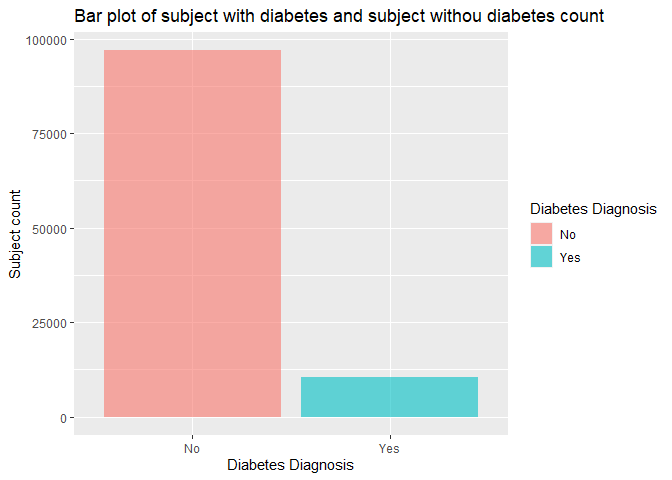
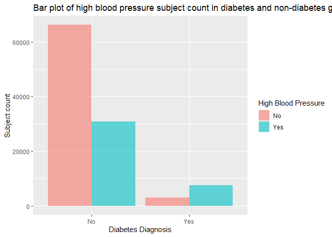

Project 3
================
Vivi
2023-11-02

- [Introduction](#introduction)
- [Data](#data)
- [Summarizations](#summarizations)
  - [The response: “Diabetes_binary”](#the-response-diabetes_binary)
  - [Contigency table and Chi-square](#contigency-table-and-chi-square)
  - [“HighBP”](#highbp)
  - [“HighChol”](#highchol)
  - [“BMI”](#bmi)
  - [Correlation among numeric
    variables](#correlation-among-numeric-variables)
- [Modeling](#modeling)
  - [Training and test set](#training-and-test-set)
  - [Log-Loss](#log-loss)
  - [Logistic regression](#logistic-regression)
  - [Random forest](#random-forest)

# Introduction

# Data

First of all, We will call the required packages and read in the
“diabetes_binary_health_indicators_BRFSS2015.csv” file. According to the
[data
dictionary](https://www.kaggle.com/datasets/alexteboul/diabetes-health-indicators-dataset/?select=diabetes_binary_health_indicators_BRFSS2015.csv),
there are 22 columns and most of them are categorical variables, we will
convert them to factors and replace the original variables in the code
below using a `as.factor` function. Lastly, we will use a `filter`
function and subset the “diabetes” data set corresponding to the
`params$Education` value in YAML header for R markdown automation
purpose.

``` r
library(tidyverse)
library(ggplot2)
library(caret)
library(GGally)
library(devtools)
library(leaps)
library(glmnet)


diabetes <- read_csv(file = "diabetes_binary_health_indicators_BRFSS2015.csv")

# for log-loss purpose, create a new variable and assign value as "YES" for the records have Diabetes_binary = 1 and 'NO' otherwise.
diabetes <- diabetes %>%
            mutate(diabetes_dx = as.factor(if_else(Diabetes_binary == 1, 'Yes', 'No')))
#use `as.factor` function to replace the original variables.
diabetes$Diabetes_binary <- as.factor(diabetes$Diabetes_binary)
diabetes$HighBP <- as.factor(diabetes$HighBP)
diabetes$HighChol <- as.factor(diabetes$HighChol)
diabetes$CholCheck <- as.factor(diabetes$CholCheck)
diabetes$Smoker <- as.factor(diabetes$Smoker)
diabetes$Stroke <- as.factor(diabetes$Stroke)
diabetes$HeartDiseaseorAttack <- as.factor(diabetes$HeartDiseaseorAttack)
diabetes$PhysActivity <- as.factor(diabetes$PhysActivity)
diabetes$Fruits <- as.factor(diabetes$Fruits)
diabetes$Veggies <- as.factor(diabetes$Veggies)
diabetes$HvyAlcoholConsump <- as.factor(diabetes$HvyAlcoholConsump)
diabetes$AnyHealthcare <- as.factor(diabetes$AnyHealthcare)
diabetes$NoDocbcCost <- as.factor(diabetes$NoDocbcCost)
diabetes$GenHlth <- as.factor(diabetes$GenHlth)
diabetes$DiffWalk <- as.factor(diabetes$DiffWalk)
diabetes$Sex <- as.factor(diabetes$Sex)
diabetes$Age <- as.factor(diabetes$Age)
diabetes$Education  <- as.factor(diabetes$Education)
diabetes$Income <- as.factor(diabetes$Income)
diabetes              
```

    ## # A tibble: 253,680 × 23
    ##    Diabetes_binary HighBP HighChol CholCheck   BMI Smoker Stroke
    ##    <fct>           <fct>  <fct>    <fct>     <dbl> <fct>  <fct> 
    ##  1 0               1      1        1            40 1      0     
    ##  2 0               0      0        0            25 1      0     
    ##  3 0               1      1        1            28 0      0     
    ##  4 0               1      0        1            27 0      0     
    ##  5 0               1      1        1            24 0      0     
    ##  6 0               1      1        1            25 1      0     
    ##  7 0               1      0        1            30 1      0     
    ##  8 0               1      1        1            25 1      0     
    ##  9 1               1      1        1            30 1      0     
    ## 10 0               0      0        1            24 0      0     
    ## # ℹ 253,670 more rows
    ## # ℹ 16 more variables: HeartDiseaseorAttack <fct>, PhysActivity <fct>,
    ## #   Fruits <fct>, Veggies <fct>, HvyAlcoholConsump <fct>, AnyHealthcare <fct>,
    ## #   NoDocbcCost <fct>, GenHlth <fct>, MentHlth <dbl>, PhysHlth <dbl>,
    ## #   DiffWalk <fct>, Sex <fct>, Age <fct>, Education <fct>, Income <fct>,
    ## #   diabetes_dx <fct>

``` r
# subset data set based on parameter in YAML header

#diabetes_sub <- diabetes %>% 

#                   filter(Education == params$Education)

diabetes_sub <- diabetes %>% 

                   filter(Education == "6")

diabetes_sub
```

    ## # A tibble: 107,325 × 23
    ##    Diabetes_binary HighBP HighChol CholCheck   BMI Smoker Stroke
    ##    <fct>           <fct>  <fct>    <fct>     <dbl> <fct>  <fct> 
    ##  1 0               0      0        0            25 1      0     
    ##  2 0               1      1        1            25 1      0     
    ##  3 0               1      0        1            30 1      0     
    ##  4 1               0      0        1            25 1      0     
    ##  5 0               0      1        1            33 1      1     
    ##  6 0               1      0        1            33 0      0     
    ##  7 0               0      0        0            23 0      0     
    ##  8 0               0      1        1            28 0      0     
    ##  9 0               0      0        1            32 0      0     
    ## 10 1               1      1        1            37 1      1     
    ## # ℹ 107,315 more rows
    ## # ℹ 16 more variables: HeartDiseaseorAttack <fct>, PhysActivity <fct>,
    ## #   Fruits <fct>, Veggies <fct>, HvyAlcoholConsump <fct>, AnyHealthcare <fct>,
    ## #   NoDocbcCost <fct>, GenHlth <fct>, MentHlth <dbl>, PhysHlth <dbl>,
    ## #   DiffWalk <fct>, Sex <fct>, Age <fct>, Education <fct>, Income <fct>,
    ## #   diabetes_dx <fct>

# Summarizations

Now we are ready to perform an exploratory data analysis, and give some
Summarizations about the center, spread and distribution of numeric
variables in the form of tables and plots. Also provide contingency
tables and bar plots for categorical variables.

## The response: “Diabetes_binary”

Since “Diabetes_binary” is a binary variable, we will create a one way
contingency table with `table` function to see the count of subjects
with and without diabetes in this education group. Also visualize the
result in a bar chart using `ggplot` + `geom_bar` function. For label
specification on x axis, x ticks, y axis and legend, we will use the
`scale_x_discrete`, the `scale_fill_discrete` and the `labs` functions.

``` r
table(diabetes_sub$Diabetes_binary)
```

    ## 
    ##     0     1 
    ## 96925 10400

``` r
g <- ggplot(data = diabetes_sub, aes(x = Diabetes_binary, fill = Diabetes_binary))
g + geom_bar(alpha = 0.6) +
  scale_x_discrete(breaks=c("0","1"),
        labels=c("No", "Yes")) +
  scale_fill_discrete(name = "Diabetes Diagnosis", labels = c("No", "Yes")) +
  labs(x = "Diabetes Diagnosis", y = "Subject count", title = "Bar plot of subject with diabetes and subject withou diabetes count") 
```

<!-- -->

From this bar chart, we can see which diagnosis group has more subjects
in this education level.

## Contigency table and Chi-square

Now we want to investigate the relationship between having diabetes vs
all the categorical variables. we will create a function which generates
a contingency table, calculates the row percentage for each level of the
corresponding categorical variable in both diagnosis groups, and gives
the chi-square result based on the contingency table.

``` r
chisq <- function (x) {
  #generate contingency table
  a <- table(diabetes_sub$Diabetes_binary, x)
  #calculate the row percentage and combine with original data set
  c <- cbind(a, a/rowSums(a))
  #run chi-square test
  b <- chisq.test(a, correct=FALSE)
  return(list(a, c, b))
}

chisq(diabetes_sub$HighBP)
```

    ## [[1]]
    ##    x
    ##         0     1
    ##   0 66157 30768
    ##   1  2930  7470
    ## 
    ## [[2]]
    ##       0     1         0         1
    ## 0 66157 30768 0.6825587 0.3174413
    ## 1  2930  7470 0.2817308 0.7182692
    ## 
    ## [[3]]
    ## 
    ##  Pearson's Chi-squared test
    ## 
    ## data:  a
    ## X-squared = 6579.5, df = 1, p-value < 2.2e-16

``` r
chisq(diabetes_sub$HighChol)
```

    ## [[1]]
    ##    x
    ##         0     1
    ##   0 61767 35158
    ##   1  3604  6796
    ## 
    ## [[2]]
    ##       0     1         0         1
    ## 0 61767 35158 0.6372659 0.3627341
    ## 1  3604  6796 0.3465385 0.6534615
    ## 
    ## [[3]]
    ## 
    ##  Pearson's Chi-squared test
    ## 
    ## data:  a
    ## X-squared = 3334.1, df = 1, p-value < 2.2e-16

``` r
chisq(diabetes_sub$CholCheck)
```

    ## [[1]]
    ##    x
    ##         0     1
    ##   0  3761 93164
    ##   1    49 10351
    ## 
    ## [[2]]
    ##      0     1           0         1
    ## 0 3761 93164 0.038803198 0.9611968
    ## 1   49 10351 0.004711538 0.9952885
    ## 
    ## [[3]]
    ## 
    ##  Pearson's Chi-squared test
    ## 
    ## data:  a
    ## X-squared = 318.81, df = 1, p-value < 2.2e-16

``` r
chisq(diabetes_sub$Smoker)
```

    ## [[1]]
    ##    x
    ##         0     1
    ##   0 64668 32257
    ##   1  5847  4553
    ## 
    ## [[2]]
    ##       0     1         0         1
    ## 0 64668 32257 0.6671963 0.3328037
    ## 1  5847  4553 0.5622115 0.4377885
    ## 
    ## [[3]]
    ## 
    ##  Pearson's Chi-squared test
    ## 
    ## data:  a
    ## X-squared = 459.38, df = 1, p-value < 2.2e-16

``` r
chisq(diabetes_sub$Stroke)
```

    ## [[1]]
    ##    x
    ##         0     1
    ##   0 94869  2056
    ##   1  9635   765
    ## 
    ## [[2]]
    ##       0    1         0          1
    ## 0 94869 2056 0.9787877 0.02121228
    ## 1  9635  765 0.9264423 0.07355769
    ## 
    ## [[3]]
    ## 
    ##  Pearson's Chi-squared test
    ## 
    ## data:  a
    ## X-squared = 1005.5, df = 1, p-value < 2.2e-16

``` r
chisq(diabetes_sub$HeartDiseaseorAttack)
```

    ## [[1]]
    ##    x
    ##         0     1
    ##   0 91849  5076
    ##   1  8393  2007
    ## 
    ## [[2]]
    ##       0    1         0          1
    ## 0 91849 5076 0.9476296 0.05237039
    ## 1  8393 2007 0.8070192 0.19298077
    ## 
    ## [[3]]
    ## 
    ##  Pearson's Chi-squared test
    ## 
    ## data:  a
    ## X-squared = 3012.6, df = 1, p-value < 2.2e-16

``` r
chisq(diabetes_sub$PhysActivity)
```

    ## [[1]]
    ##    x
    ##         0     1
    ##   0 13781 83144
    ##   1  2849  7551
    ## 
    ## [[2]]
    ##       0     1         0         1
    ## 0 13781 83144 0.1421821 0.8578179
    ## 1  2849  7551 0.2739423 0.7260577
    ## 
    ## [[3]]
    ## 
    ##  Pearson's Chi-squared test
    ## 
    ## data:  a
    ## X-squared = 1245.3, df = 1, p-value < 2.2e-16

``` r
chisq(diabetes_sub$Fruits)
```

    ## [[1]]
    ##    x
    ##         0     1
    ##   0 29108 67817
    ##   1  3760  6640
    ## 
    ## [[2]]
    ##       0     1         0         1
    ## 0 29108 67817 0.3003147 0.6996853
    ## 1  3760  6640 0.3615385 0.6384615
    ## 
    ## [[3]]
    ## 
    ##  Pearson's Chi-squared test
    ## 
    ## data:  a
    ## X-squared = 165.7, df = 1, p-value < 2.2e-16

``` r
chisq(diabetes_sub$Veggies)
```

    ## [[1]]
    ##    x
    ##         0     1
    ##   0 12068 84857
    ##   1  1794  8606
    ## 
    ## [[2]]
    ##       0     1         0         1
    ## 0 12068 84857 0.1245086 0.8754914
    ## 1  1794  8606 0.1725000 0.8275000
    ## 
    ## [[3]]
    ## 
    ##  Pearson's Chi-squared test
    ## 
    ## data:  a
    ## X-squared = 192.32, df = 1, p-value < 2.2e-16

``` r
chisq(diabetes_sub$HvyAlcoholConsump)
```

    ## [[1]]
    ##    x
    ##         0     1
    ##   0 90705  6220
    ##   1 10125   275
    ## 
    ## [[2]]
    ##       0    1         0          1
    ## 0 90705 6220 0.9358267 0.06417333
    ## 1 10125  275 0.9735577 0.02644231
    ## 
    ## [[3]]
    ## 
    ##  Pearson's Chi-squared test
    ## 
    ## data:  a
    ## X-squared = 235.18, df = 1, p-value < 2.2e-16

``` r
chisq(diabetes_sub$AnyHealthcare)
```

    ## [[1]]
    ##    x
    ##         0     1
    ##   0  2376 94549
    ##   1   218 10182
    ## 
    ## [[2]]
    ##      0     1          0         1
    ## 0 2376 94549 0.02451380 0.9754862
    ## 1  218 10182 0.02096154 0.9790385
    ## 
    ## [[3]]
    ## 
    ##  Pearson's Chi-squared test
    ## 
    ## data:  a
    ## X-squared = 5.025, df = 1, p-value = 0.02498

``` r
chisq(diabetes_sub$NoDocbcCost)
```

    ## [[1]]
    ##    x
    ##         0     1
    ##   0 91874  5051
    ##   1  9659   741
    ## 
    ## [[2]]
    ##       0    1         0          1
    ## 0 91874 5051 0.9478875 0.05211246
    ## 1  9659  741 0.9287500 0.07125000
    ## 
    ## [[3]]
    ## 
    ##  Pearson's Chi-squared test
    ## 
    ## data:  a
    ## X-squared = 67.376, df = 1, p-value = 2.243e-16

``` r
chisq(diabetes_sub$GenHlth)
```

    ## [[1]]
    ##    x
    ##         1     2     3     4     5
    ##   0 26023 41480 22751  5274  1397
    ##   1   463  2626  4343  2146   822
    ## 
    ## [[2]]
    ##       1     2     3    4    5          1         2         3          4
    ## 0 26023 41480 22751 5274 1397 0.26848594 0.4279598 0.2347279 0.05441321
    ## 1   463  2626  4343 2146  822 0.04451923 0.2525000 0.4175962 0.20634615
    ##            5
    ## 0 0.01441321
    ## 1 0.07903846
    ## 
    ## [[3]]
    ## 
    ##  Pearson's Chi-squared test
    ## 
    ## data:  a
    ## X-squared = 8890, df = 4, p-value < 2.2e-16

``` r
chisq(diabetes_sub$DiffWalk)
```

    ## [[1]]
    ##    x
    ##         0     1
    ##   0 89388  7537
    ##   1  7647  2753
    ## 
    ## [[2]]
    ##       0    1         0          1
    ## 0 89388 7537 0.9222388 0.07776116
    ## 1  7647 2753 0.7352885 0.26471154
    ## 
    ## [[3]]
    ## 
    ##  Pearson's Chi-squared test
    ## 
    ## data:  a
    ## X-squared = 3786.9, df = 1, p-value < 2.2e-16

``` r
chisq(diabetes_sub$Sex)
```

    ## [[1]]
    ##    x
    ##         0     1
    ##   0 53299 43626
    ##   1  4538  5862
    ## 
    ## [[2]]
    ##       0     1         0         1
    ## 0 53299 43626 0.5498994 0.4501006
    ## 1  4538  5862 0.4363462 0.5636538
    ## 
    ## [[3]]
    ## 
    ##  Pearson's Chi-squared test
    ## 
    ## data:  a
    ## X-squared = 487.38, df = 1, p-value < 2.2e-16

``` r
chisq(diabetes_sub$Income)
```

    ## [[1]]
    ##    x
    ##         1     2     3     4     5     6     7     8
    ##   0  1087  1230  1908  3136  5507 10773 17638 55646
    ##   1   220   315   434   584   983  1597  2094  4173
    ## 
    ## [[2]]
    ##      1    2    3    4    5     6     7     8          1          2          3
    ## 0 1087 1230 1908 3136 5507 10773 17638 55646 0.01121486 0.01269022 0.01968532
    ## 1  220  315  434  584  983  1597  2094  4173 0.02115385 0.03028846 0.04173077
    ##            4          5         6         7        8
    ## 0 0.03235491 0.05681713 0.1111478 0.1819758 0.574114
    ## 1 0.05615385 0.09451923 0.1535577 0.2013462 0.401250
    ## 
    ## [[3]]
    ## 
    ##  Pearson's Chi-squared test
    ## 
    ## data:  a
    ## X-squared = 1531, df = 7, p-value < 2.2e-16

We need to pay attention to the categorical variable with a significant
chi-square result (p value smaller than 0.05), that means this
categorical variable may have certain relationship with the diabetes
diagnosis.

## “HighBP”

As we all know, high blood pressure and diabetes are related, we want to
create a bar chart and visualize the high blood pressure subjects’ count
and ratio in each diagnosis group. Here we will again, use the `gglot`
function and the `geom_bar` function to create the plot. Like last bar
chart, we also will set labels for x axis, x ticks, y axis and legend
with the `scale_x_discrete`, the `scale_fill_discrete` and the`labs`
functions.

``` r
# create a bar plot using the gglot and the geom_bar function.
h <- ggplot(data = diabetes_sub, aes(x = Diabetes_binary, fill = HighBP))
h + geom_bar(position = "dodge", alpha = 0.6) +
  scale_x_discrete(breaks=c("0","1"),
       labels=c("No", "Yes")) +
  scale_fill_discrete(name = "High Blood Pressure", labels = c("No", "Yes")) +
  labs(x = "Diabetes Diagnosis", y = "Subject count", title = "Bar plot of high blood pressure subject count in diabetes and non-diabetes group")
```

<!-- -->

In the bar chart above, we need to focus on the count and ratio of
subjects with high blood pressure vs subjects without in both diabetes
and non-diabetes group, and verify if the ratio of high blood pressure
subjects in the diabetes group is higher than the non-diabetes group’s
as we assumed.

## “HighChol”

Another health condition that associates with diabetes is high
cholesterol, we also want to create a bar chart and compare the high
cholesterol subjects’ count and ratio in each diagnosis group, using all
the functions we used for previous bar plots.

``` r
# create a bar plot using the gglot and the geom_bar function.
h <- ggplot(data = diabetes_sub, aes(x = Diabetes_binary, fill = HighChol))
h + geom_bar(position = "dodge", alpha = 0.6) +
  scale_x_discrete(breaks=c("0","1"),
       labels=c("No", "Yes")) +
  scale_fill_discrete(name = "High Cholesterol", labels = c("No", "Yes")) +
  labs(x = "Diabetes Diagnosis", y = "Subject count", title = "Bar plot of high cholesterol subject count in diabetes and non-diabetes group")
```

<!-- -->

In the bar chart above, we also need to look at the count and ratio of
subjects with high cholesterol vs subjects without in both diabetes and
non-diabetes group, and verify if the ratio of high cholesterol subjects
in the diabetes group is higher than the non-diabetes group’s as we
expected.

## “BMI”

The association of high BMI and diabetes are proved in many scientific
studies, in order to verify if this association also exists in our data,
we are looking into the distribution of BMI in both diagnosis group by
creating a summary table using `group_by` and `summarise` function, as
well as generating a kernel density plot with `ggplot` and
`geom_density` function. Additionally, we want to conduct a two sample
t-test with `t.test` function and investigate if the means in each
diagnosis group are different from each other.

``` r
#create a summary table for BMI to display the center and spread
diabetes_sub %>%
  group_by(Diabetes_binary) %>%
  summarise(Mean = mean(BMI),  Standard_Deviation = sd(BMI), 
            Variance = var(BMI), Median = median(BMI), 
            q1 = quantile(BMI, probs = 0.25),
            q3 = quantile(BMI, probs = 0.75))
```

    ## # A tibble: 2 × 7
    ##   Diabetes_binary  Mean Standard_Deviation Variance Median    q1    q3
    ##   <fct>           <dbl>              <dbl>    <dbl>  <dbl> <dbl> <dbl>
    ## 1 0                27.1               5.98     35.7     26    23    30
    ## 2 1                31.4               7.06     49.9     30    27    35

``` r
#generate a kernal density plot to show the distribution of BMI
i <- ggplot(data = diabetes_sub, aes(x = BMI, fill = Diabetes_binary)) 
i + geom_density(adjust = 1, color="#e9ecef", alpha=0.5, position = 'dodge') +
  scale_fill_manual(values=c("#69b3a2", "#404080")) +
  labs(x = "BMI", title = "Kernal density plot of BMI distribution across diagnosis group") 
```

<!-- -->

``` r
#conduct a two sample t test for BMI in both diagnosis groups
t.test(BMI ~ Diabetes_binary, data = diabetes_sub, alternative = "two.sided", var.equal = FALSE)
```

    ## 
    ##  Welch Two Sample t-test
    ## 
    ## data:  BMI by Diabetes_binary
    ## t = -59.195, df = 12052, p-value < 2.2e-16
    ## alternative hypothesis: true difference in means between group 0 and group 1 is not equal to 0
    ## 95 percent confidence interval:
    ##  -4.394665 -4.112947
    ## sample estimates:
    ## mean in group 0 mean in group 1 
    ##        27.10773        31.36154

The summary table gives us the center (mean and median) and spread
(standard_deviation, variance, q1 and q3) of BMI in each diagnosis
group. The density plot shows the distribution of BMI in each diagnosis
group, we can estimate the means and standard deviations, also visualize
their differences. Lastly, the two sample t-test returns the 95%
confidence interval of mean difference, and the t statistic, degree of
freedom and p-value as t-test result, we need to see if the p-value is
smaller than 0.05 to decide whether we will reject the null hypothesis
(true difference in means between two diagnosis is equal to 0).

## Correlation among numeric variables

Before fitting any model, we also want to test the correlation among
numeric variables, in case there is collinearity that diminishes our
ability to determine which variables are responsible for change in the
response variable. For this reason, we should determine correlations
between all variables and consider removing ones that are problematic.
We can do this by creating a correlation plot with `ggpairs()` from the
`GGally` package.

``` r
x <- diabetes_sub[, c(5, 16, 17)] 
GGally::ggpairs(x)
```

<!-- -->

Let’s look for the pairs that have correlation coefficient higher than
0.4. If we do find such pairs, we need to refer to the relationship
between each variable and the response, as well as some background
knowledge (may do a literature review), in order to decide which
variable will be include into the models.

# Modeling

Since we gained some basic understanding of the data, we can now fit
different models and select the best one for prediction.

## Training and test set

The first step is to split our data to a training and test set. We will
use the `createDataPartition` function and split the data by 70% as the
training set and 30% as the test set.

``` r
set.seed(20)
index <- createDataPartition(diabetes_sub$Diabetes_binary, p = 0.70, list = FALSE)
train <- diabetes_sub[index, ]
test <- diabetes_sub[-index, ]
```

## Log-Loss

All of our models’ performance will be evaluated by Log-loss. Log loss,
also known as logarithmic loss, indicates how close a prediction
probability comes to the corresponding true binary value. Thus, it is a
common evaluation metric for binary classification models. There are
three steps to calculate Log Loss:

1.  Finding the corrected probabilities.  
2.  Taking a log of corrected probabilities.  
3.  Taking the negative average of the values from step 2.

And the formula is as below:


From the formula we can tell, the lower log-loss is, the better the
model performs.

The reason that log-loss is preferred to accuracy is: For accuracy,
model returns 1 if predicted probability is \> .5 otherwise 0. We could
get some prediction probabilities very close to 0.5, but are converted
to 1 and 0 which actually match with the true results. Such model could
have 100% accuracy but their prediction probabilities are at board line
of being wrong. If we use accuracy for model selection, we will keep a
bad model. On the other hand, log-loss calculate how far away the
prediction probabilities are from the true values, and the log-loss of
such model will be high, which reveal the model’s true performance.
Thus, log-loss is more reliable and accurate for model selection.

## Logistic regression

The first model we are fitting is logistic regression, which is a
generalized linear model that models the probability of an event by
calculating the log-odds for the event based on the linear combination
of one or more independent variables. The most common logistic
regression has a single binary variable as the response, usually the two
val ues are coded as “0” and “1”.

In logistic regression, the dependent variable is a logit, which is the
natural log of the odds and assumed to be linearly related to X as the
formula below:


In our data set, logistic regression models are more suitable for our
binary response than linear regression models because:

1.  If we use linear regression, the predicted values will become
    greater than one and less than zero if we move far enough on the
    X-axis. Such values are not realistic for binary variable.  
2.  One of the assumptions of regression is that the variance of Y is
    constant across values of X (homoscedasticity). This can not be the
    case with a binary variable.  
3.  The significance testing of the b weights rest upon the assumption
    that errors of prediction (Y-Y’) are normally distributed. Because Y
    only takes the values 0 and 1, this assumption is pretty hard to
    justify.

Now, let’s fit 3 logistic regression models with the `train` function on
the training data set, and use cross-validation with 5 folds for model
selection. After the best model is picked, use the `predict` function to
apply it on the test data set and merge the predicted results with the
test set’s true response. Lastly, use the `mnLogLoss` function to
compare their performance with a log-loss method.

### Model one

We will include all the low level variables in our first model:

``` r
#fit the model on the training data set
full_log <- train(diabetes_dx ~ HighBP + HighChol + CholCheck + BMI + Smoker + Stroke + HeartDiseaseorAttack 
                  + PhysActivity + Fruits + Veggies + HvyAlcoholConsump + AnyHealthcare + NoDocbcCost + GenHlth + MentHlth 
                  + PhysHlth + DiffWalk + Sex + Age + Income,
              data=train, 
              method = "glm", 
              family = "binomial",
              metric="logLoss",
              preProcess = c("center", "scale"),
              trControl = trainControl(method = "cv", number = 5, classProbs=TRUE, summaryFunction=mnLogLoss))
full_log
```

    ## Generalized Linear Model 
    ## 
    ## 75128 samples
    ##    20 predictor
    ##     2 classes: 'No', 'Yes' 
    ## 
    ## Pre-processing: centered (40), scaled (40) 
    ## Resampling: Cross-Validated (5 fold) 
    ## Summary of sample sizes: 60103, 60102, 60102, 60103, 60102 
    ## Resampling results:
    ## 
    ##   logLoss  
    ##   0.2462948

``` r
summary(full_log)
```

    ## 
    ## Call:
    ## NULL
    ## 
    ## Coefficients:
    ##                        Estimate Std. Error  z value Pr(>|z|)    
    ## (Intercept)           -3.057994   0.023246 -131.551  < 2e-16 ***
    ## HighBP1                0.375021   0.014750   25.425  < 2e-16 ***
    ## HighChol1              0.234252   0.014099   16.614  < 2e-16 ***
    ## CholCheck1             0.272190   0.032544    8.364  < 2e-16 ***
    ## BMI                    0.361193   0.011994   30.114  < 2e-16 ***
    ## Smoker1                0.013268   0.013523    0.981  0.32652    
    ## Stroke1                0.025724   0.009618    2.674  0.00749 ** 
    ## HeartDiseaseorAttack1  0.070558   0.010042    7.026 2.12e-12 ***
    ## PhysActivity1         -0.020864   0.012358   -1.688  0.09136 .  
    ## Fruits1               -0.054116   0.013785   -3.926 8.64e-05 ***
    ## Veggies1              -0.008014   0.012846   -0.624  0.53272    
    ## HvyAlcoholConsump1    -0.190391   0.018810  -10.122  < 2e-16 ***
    ## AnyHealthcare1        -0.008496   0.015205   -0.559  0.57634    
    ## NoDocbcCost1           0.017810   0.013392    1.330  0.18355    
    ## GenHlth2               0.456048   0.030866   14.775  < 2e-16 ***
    ## GenHlth3               0.734173   0.027057   27.134  < 2e-16 ***
    ## GenHlth4               0.549160   0.018246   30.097  < 2e-16 ***
    ## GenHlth5               0.363707   0.013666   26.615  < 2e-16 ***
    ## MentHlth              -0.033673   0.013033   -2.584  0.00978 ** 
    ## PhysHlth              -0.033922   0.013677   -2.480  0.01313 *  
    ## DiffWalk1              0.031384   0.011848    2.649  0.00807 ** 
    ## Sex1                   0.169109   0.014411   11.734  < 2e-16 ***
    ## Age2                  -0.051021   0.067230   -0.759  0.44791    
    ## Age3                   0.069479   0.073425    0.946  0.34402    
    ## Age4                   0.120322   0.079250    1.518  0.12895    
    ## Age5                   0.274119   0.083311    3.290  0.00100 ** 
    ## Age6                   0.279447   0.089057    3.138  0.00170 ** 
    ## Age7                   0.441135   0.094057    4.690 2.73e-06 ***
    ## Age8                   0.465968   0.099172    4.699 2.62e-06 ***
    ## Age9                   0.565636   0.105020    5.386 7.20e-08 ***
    ## Age10                  0.629083   0.104069    6.045 1.50e-09 ***
    ## Age11                  0.531182   0.087231    6.089 1.13e-09 ***
    ## Age12                  0.400751   0.068526    5.848 4.97e-09 ***
    ## Age13                  0.370520   0.069644    5.320 1.04e-07 ***
    ## Income2               -0.005960   0.015978   -0.373  0.70914    
    ## Income3                0.005075   0.018266    0.278  0.78112    
    ## Income4               -0.008503   0.021889   -0.388  0.69767    
    ## Income5               -0.006887   0.026876   -0.256  0.79776    
    ## Income6               -0.017969   0.035025   -0.513  0.60792    
    ## Income7               -0.062760   0.042002   -1.494  0.13511    
    ## Income8               -0.165437   0.052981   -3.123  0.00179 ** 
    ## ---
    ## Signif. codes:  0 '***' 0.001 '**' 0.01 '*' 0.05 '.' 0.1 ' ' 1
    ## 
    ## (Dispersion parameter for binomial family taken to be 1)
    ## 
    ##     Null deviance: 47815  on 75127  degrees of freedom
    ## Residual deviance: 36910  on 75087  degrees of freedom
    ## AIC: 36992
    ## 
    ## Number of Fisher Scoring iterations: 7

``` r
#apply the best model on the test set and merge the predicted results with the true response into one data frame
predicted <- data.frame(obs=test$diabetes_dx,
             pred=predict(full_log, test),
             predict(full_log, test, type="prob"))

#calculate the log-loss
mnLogLoss(predicted, lev = levels(predicted$obs))
```

    ##   logLoss 
    ## 0.2448419

### Model two

We will include all the low level variables and interactions between
HighBP & HighChol, HighBP & BMI, HighChol & BMI, PhysActivity & BMI, and
BMI & GenHlth in our second model:

``` r
#fit the model on the training data set
inter_log <- train(diabetes_dx ~ HighBP + HighChol + CholCheck + BMI + Smoker + Stroke + HeartDiseaseorAttack 
                  + PhysActivity + Fruits + Veggies + HvyAlcoholConsump + AnyHealthcare + NoDocbcCost + GenHlth + MentHlth 
                  + PhysHlth + DiffWalk + Sex + Age + Income + HighBP:HighChol + HighBP:BMI + HighChol:BMI + PhysActivity:BMI + BMI:GenHlth,
              data=train, 
              method = "glm", 
              family = "binomial",
              metric="logLoss",
              preProcess = c("center", "scale"),
              trControl = trainControl(method = "cv", number = 5, classProbs=TRUE, summaryFunction=mnLogLoss))
inter_log
```

    ## Generalized Linear Model 
    ## 
    ## 75128 samples
    ##    20 predictor
    ##     2 classes: 'No', 'Yes' 
    ## 
    ## Pre-processing: centered (48), scaled (48) 
    ## Resampling: Cross-Validated (5 fold) 
    ## Summary of sample sizes: 60103, 60102, 60102, 60103, 60102 
    ## Resampling results:
    ## 
    ##   logLoss  
    ##   0.2462299

``` r
summary(inter_log)
```

    ## 
    ## Call:
    ## NULL
    ## 
    ## Coefficients:
    ##                        Estimate Std. Error  z value Pr(>|z|)    
    ## (Intercept)           -3.051325   0.023833 -128.030  < 2e-16 ***
    ## HighBP1                0.265025   0.061873    4.283 1.84e-05 ***
    ## HighChol1              0.131255   0.058993    2.225  0.02609 *  
    ## CholCheck1             0.270199   0.032560    8.298  < 2e-16 ***
    ## BMI                    0.279899   0.047670    5.872 4.32e-09 ***
    ## Smoker1                0.013490   0.013543    0.996  0.31921    
    ## Stroke1                0.026723   0.009649    2.769  0.00562 ** 
    ## HeartDiseaseorAttack1  0.071142   0.010071    7.064 1.62e-12 ***
    ## PhysActivity1         -0.151705   0.050895   -2.981  0.00288 ** 
    ## Fruits1               -0.053982   0.013806   -3.910 9.23e-05 ***
    ## Veggies1              -0.008967   0.012861   -0.697  0.48565    
    ## HvyAlcoholConsump1    -0.189230   0.018816  -10.057  < 2e-16 ***
    ## AnyHealthcare1        -0.008648   0.015253   -0.567  0.57074    
    ## NoDocbcCost1           0.017829   0.013443    1.326  0.18473    
    ## GenHlth2               0.581703   0.108006    5.386 7.21e-08 ***
    ## GenHlth3               0.817628   0.095453    8.566  < 2e-16 ***
    ## GenHlth4               0.569746   0.062891    9.059  < 2e-16 ***
    ## GenHlth5               0.268533   0.047113    5.700 1.20e-08 ***
    ## MentHlth              -0.034317   0.013094   -2.621  0.00877 ** 
    ## PhysHlth              -0.033566   0.013714   -2.448  0.01438 *  
    ## DiffWalk1              0.029224   0.011907    2.454  0.01411 *  
    ## Sex1                   0.169321   0.014437   11.728  < 2e-16 ***
    ## Age2                  -0.050483   0.067144   -0.752  0.45213    
    ## Age3                   0.072115   0.073340    0.983  0.32546    
    ## Age4                   0.119392   0.079171    1.508  0.13155    
    ## Age5                   0.271187   0.083238    3.258  0.00112 ** 
    ## Age6                   0.274629   0.088989    3.086  0.00203 ** 
    ## Age7                   0.436930   0.093971    4.650 3.33e-06 ***
    ## Age8                   0.461016   0.099084    4.653 3.27e-06 ***
    ## Age9                   0.561857   0.104922    5.355 8.56e-08 ***
    ## Age10                  0.626787   0.103968    6.029 1.65e-09 ***
    ## Age11                  0.530329   0.087146    6.086 1.16e-09 ***
    ## Age12                  0.400360   0.068462    5.848 4.98e-09 ***
    ## Age13                  0.372241   0.069574    5.350 8.78e-08 ***
    ## Income2               -0.006109   0.016089   -0.380  0.70417    
    ## Income3                0.005237   0.018371    0.285  0.77557    
    ## Income4               -0.008598   0.022024   -0.390  0.69626    
    ## Income5               -0.006635   0.027041   -0.245  0.80618    
    ## Income6               -0.016027   0.035251   -0.455  0.64937    
    ## Income7               -0.060963   0.042273   -1.442  0.14927    
    ## Income8               -0.162910   0.053332   -3.055  0.00225 ** 
    ## `HighBP1:HighChol1`   -0.034656   0.024040   -1.442  0.14942    
    ## `HighBP1:BMI`          0.134878   0.058701    2.298  0.02158 *  
    ## `HighChol1:BMI`        0.126678   0.054864    2.309  0.02095 *  
    ## `BMI:PhysActivity1`    0.130314   0.048962    2.662  0.00778 ** 
    ## `BMI:GenHlth2`        -0.125862   0.103589   -1.215  0.22436    
    ## `BMI:GenHlth3`        -0.090702   0.097129   -0.934  0.35039    
    ## `BMI:GenHlth4`        -0.026276   0.065447   -0.401  0.68807    
    ## `BMI:GenHlth5`         0.094995   0.047706    1.991  0.04645 *  
    ## ---
    ## Signif. codes:  0 '***' 0.001 '**' 0.01 '*' 0.05 '.' 0.1 ' ' 1
    ## 
    ## (Dispersion parameter for binomial family taken to be 1)
    ## 
    ##     Null deviance: 47815  on 75127  degrees of freedom
    ## Residual deviance: 36877  on 75079  degrees of freedom
    ## AIC: 36975
    ## 
    ## Number of Fisher Scoring iterations: 7

``` r
#apply the best model on the test set and merge the predicted results with the true response into one data frame
predicted2 <- data.frame(obs=test$diabetes_dx,
             pred=predict(inter_log, test),
             predict(inter_log, test, type="prob"))

#calculate the log-loss
mnLogLoss(predicted2, lev = levels(predicted2$obs))
```

    ##   logLoss 
    ## 0.2447858

### Model three

We will include all the low level variables and polynomial term for
numeric variables in our third model:

``` r
#fit the model on the training data set
poly_log <- train(diabetes_dx ~  HighBP + HighChol + CholCheck + I(BMI^2) + BMI + Smoker 
                  + Stroke + HeartDiseaseorAttack + PhysActivity + Fruits + Veggies + HvyAlcoholConsump + AnyHealthcare + NoDocbcCost + GenHlth 
                  + I(MentHlth^2) + MentHlth + I(PhysHlth^2) + PhysHlth + DiffWalk + Sex + Age + Income,
              data=train, 
              method = "glm", 
              family = "binomial",
              metric="logLoss",
              preProcess = c("center", "scale"),
              trControl = trainControl(method = "cv", number = 5, classProbs=TRUE, summaryFunction=mnLogLoss))
poly_log
```

    ## Generalized Linear Model 
    ## 
    ## 75128 samples
    ##    20 predictor
    ##     2 classes: 'No', 'Yes' 
    ## 
    ## Pre-processing: centered (43), scaled (43) 
    ## Resampling: Cross-Validated (5 fold) 
    ## Summary of sample sizes: 60103, 60102, 60102, 60103, 60102 
    ## Resampling results:
    ## 
    ##   logLoss  
    ##   0.2440859

``` r
summary(poly_log)
```

    ## 
    ## Call:
    ## NULL
    ## 
    ## Coefficients:
    ##                        Estimate Std. Error  z value Pr(>|z|)    
    ## (Intercept)           -3.096672   0.023604 -131.194  < 2e-16 ***
    ## HighBP1                0.344351   0.014846   23.194  < 2e-16 ***
    ## HighChol1              0.232339   0.014144   16.426  < 2e-16 ***
    ## CholCheck1             0.271133   0.032551    8.329  < 2e-16 ***
    ## `I(BMI^2)`            -0.783779   0.052723  -14.866  < 2e-16 ***
    ## BMI                    1.198069   0.054861   21.838  < 2e-16 ***
    ## Smoker1                0.015518   0.013576    1.143 0.252999    
    ## Stroke1                0.028211   0.009703    2.907 0.003643 ** 
    ## HeartDiseaseorAttack1  0.070808   0.010108    7.005 2.46e-12 ***
    ## PhysActivity1         -0.011980   0.012414   -0.965 0.334499    
    ## Fruits1               -0.047009   0.013837   -3.397 0.000680 ***
    ## Veggies1              -0.008251   0.012877   -0.641 0.521692    
    ## HvyAlcoholConsump1    -0.184761   0.018859   -9.797  < 2e-16 ***
    ## AnyHealthcare1        -0.009389   0.015285   -0.614 0.539054    
    ## NoDocbcCost1           0.017854   0.013451    1.327 0.184400    
    ## GenHlth2               0.429178   0.030905   13.887  < 2e-16 ***
    ## GenHlth3               0.698665   0.027219   25.669  < 2e-16 ***
    ## GenHlth4               0.533193   0.018417   28.952  < 2e-16 ***
    ## GenHlth5               0.357819   0.013741   26.041  < 2e-16 ***
    ## `I(MentHlth^2)`        0.191852   0.043152    4.446 8.75e-06 ***
    ## MentHlth              -0.225756   0.045527   -4.959 7.10e-07 ***
    ## `I(PhysHlth^2)`        0.005804   0.043355    0.134 0.893496    
    ## PhysHlth              -0.035130   0.046238   -0.760 0.447394    
    ## DiffWalk1              0.020129   0.011954    1.684 0.092203 .  
    ## Sex1                   0.155349   0.014545   10.681  < 2e-16 ***
    ## Age2                  -0.053435   0.067218   -0.795 0.426640    
    ## Age3                   0.069240   0.073418    0.943 0.345635    
    ## Age4                   0.102664   0.079301    1.295 0.195451    
    ## Age5                   0.258639   0.083372    3.102 0.001921 ** 
    ## Age6                   0.255108   0.089158    2.861 0.004219 ** 
    ## Age7                   0.418228   0.094167    4.441 8.94e-06 ***
    ## Age8                   0.445037   0.099290    4.482 7.39e-06 ***
    ## Age9                   0.541335   0.105152    5.148 2.63e-07 ***
    ## Age10                  0.607393   0.104207    5.829 5.58e-09 ***
    ## Age11                  0.516298   0.087352    5.911 3.41e-09 ***
    ## Age12                  0.395161   0.068627    5.758 8.51e-09 ***
    ## Age13                  0.377003   0.069754    5.405 6.49e-08 ***
    ## Income2               -0.006674   0.016038   -0.416 0.677302    
    ## Income3                0.002920   0.018338    0.159 0.873491    
    ## Income4               -0.013578   0.021966   -0.618 0.536484    
    ## Income5               -0.011185   0.026942   -0.415 0.678018    
    ## Income6               -0.027146   0.035111   -0.773 0.439442    
    ## Income7               -0.074342   0.042098   -1.766 0.077407 .  
    ## Income8               -0.177693   0.053095   -3.347 0.000818 ***
    ## ---
    ## Signif. codes:  0 '***' 0.001 '**' 0.01 '*' 0.05 '.' 0.1 ' ' 1
    ## 
    ## (Dispersion parameter for binomial family taken to be 1)
    ## 
    ##     Null deviance: 47815  on 75127  degrees of freedom
    ## Residual deviance: 36577  on 75084  degrees of freedom
    ## AIC: 36665
    ## 
    ## Number of Fisher Scoring iterations: 7

``` r
#apply the best model on the test set and merge the predicted results with the true response into one data frame
predicted3 <- data.frame(obs=test$diabetes_dx,
             pred=predict(poly_log, test),
             predict(poly_log, test, type="prob"))

#calculate the log-loss

mnLogLoss(predicted3, lev = levels(predicted3$obs))
```

    ##   logLoss 
    ## 0.2424569

From the result we can tell, the third model has the lowest log-loss
value, thus, the model with polynomial term for numeric variables is the
best logistic regression model for predicting diabetes diagnosis.

## Random forest

The next model we will fit is a tree based model called random forest.
This model is made up of multiple decision trees which are
non-parametric supervised learning method and used for classification
and regression. The goal of decision tree is to create a model that
predicts the value of a target variable by splitting the predictor into
regions with different predictions for each region. A random forest
utilizes the “bootstrap” method to takes repeatedly sampling with
replacement, fits multiple decision trees with a random subset of
predictors, then returns the average result from all the decision trees.

Random forests are generally more accurate than individual
classification trees because there is always a scope for over fitting
caused by the presence of variance in classification trees, while random
forests combine multiple trees and prevent over fitting. Random forests
also average the predicted results from classification trees and gives a
more accurate and precise prediction.

Now we can set up a random forest model for our data. we will still use
the `train` function but with method `rf`. The `tuneGrid` option is
where we tell the model how many predictor variables to grab per
bootstrap sample. The `trainControl` function within the `trControl`
option will be used for cross-validation with 5 folds for model
selection. After the best model is picked, use the `predict` function to
apply it on the test data set and merge the predicted results with the
test set’s true response. Lastly, use the `mnLogLoss` function to
compare their performance with a log-loss method.

\`\`\`
